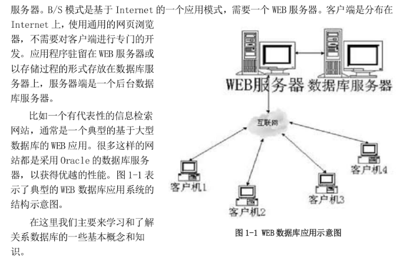
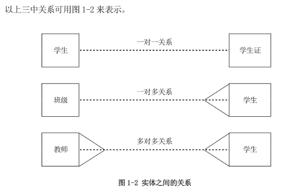
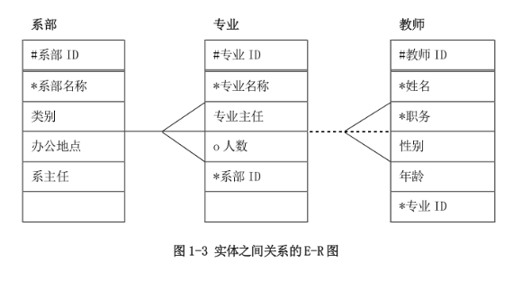
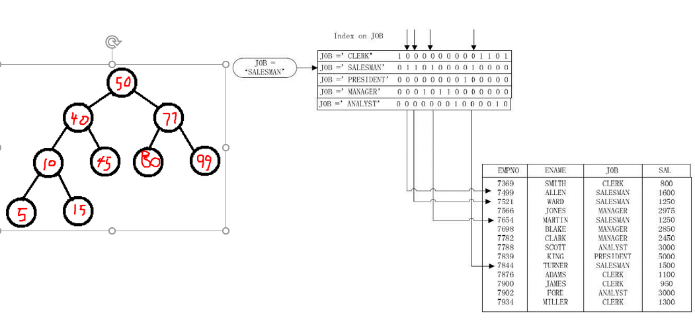
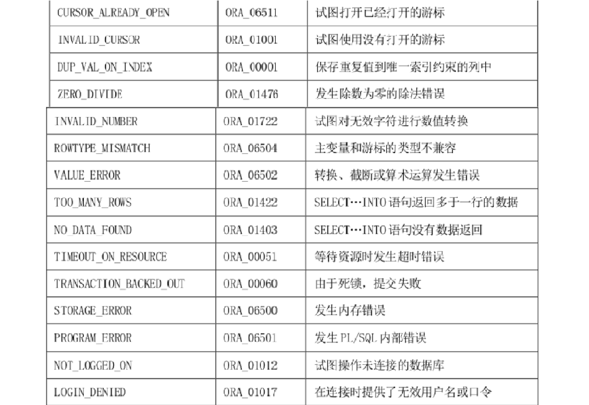
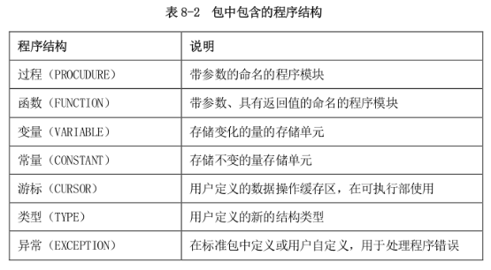
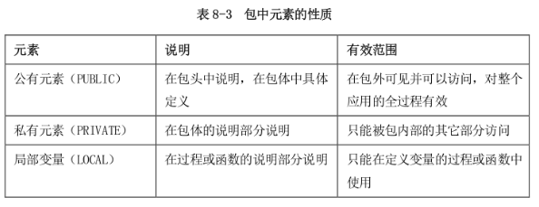
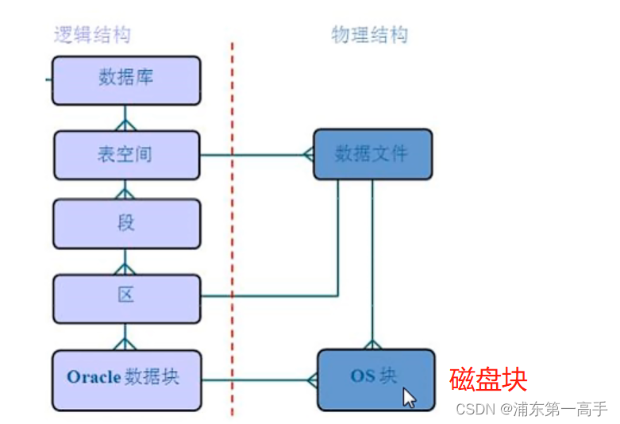
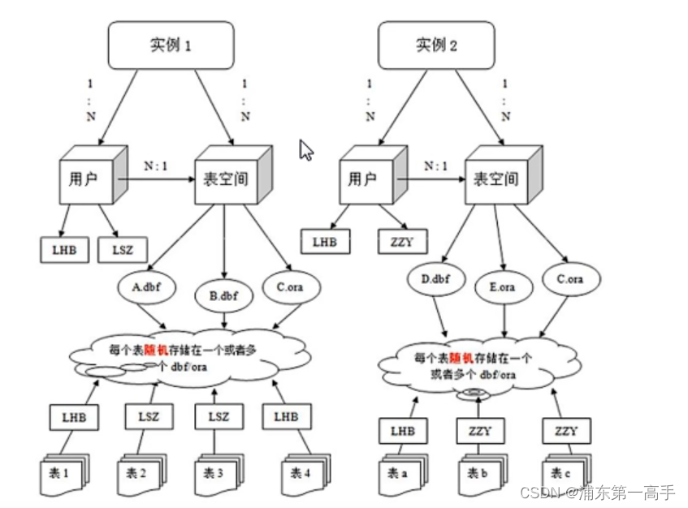

[toc]

# 引言

## 环境

虚拟机VMware下的oracle数据库系统

> sqlplus语句可以缩写，Oracle不行

## VMware终端进入Oracle

- 
  进入root：su - [root]

- 登录sqlplus：sqlplus /nolog     

  > sqlplus语句

- 用工具rlwrap登录：rlwrap sqlplus /nolog

- 以系统管理员登录Oracle数据库：conn / as sysdba

- 改用户密码：alter user scott account unlock;      //     alter user scott identified by tiger;

- 以用户身份登录Oracle数据库：conn scott/tiger

- 启动一个实例：startup

- 查看sqpplus的所有命令：help index

  > oracle里查看命令帮助：命令 --help
  >
  > 或man 命令
  >
  > - **用户登录失败原因：**
  >
  > 1. **被锁定**
  > 2. **没有登录权限**
  > 3. **忘记密码**
  > 4. **用户不存在**
  >
  > > #### （1）创建用户
  > >
  > > 有创建用户权限的用户（如系统管理员）才能创建用户。
  > >
  > > create user 用户名 identified by 密码;
  > >
  > > //修改用户的密码
  > > alter user 用户名 identified by 新密码
  > >
  > > #### （2）角色/权限
  > >
  > > //授予角色（权限的集合）
  > > grant connect,resource to 用户名;
  > >     - CONNECT角色，主要应用在临时用户，特别是那些不需要建表的用户，通常只赋予他们CONNECT role。CONNECT是使用Oracle的简单权限，拥有CONNECT角色的用户，可以与服务器建立连接会话（session，客户端对服务器连接，称为会话）。
  > >         - RESOURCE角色，更可靠和正式的数据库用户可以授予RESOURCE role。RESOURCE提供给用户另外的权限以创建他们自己的表、序列、过程（procedure）、触发器（trigger）、索引（index）等。
  > >         - DBA角色，DBA role拥有所有的系统权限----包括无限制的空间限额和给其他用户授予各种权限的能力。用户SYSTEM拥有DBA角色。
  > >         一般情况下，一个普通的用户（如SCOTT），拥有CONNECT和RESOURCE两个角色即可进行常规的数据库开发工作。
  > >
  > > //授予某一项权限
  > > grant create view to 用户名;
  > >
  > > //撤销角色/权限
  > > revoke 角色|权限 from 用户名;
  > >
  > > //查看自身有哪些角色
  > > select * from user_role_privs;
  > >
  > > //查看自身的角色和权限
  > > select * from role_sys_privs;
  > >
  > > //修改用户处于锁定（非锁定）状态，锁定状态是不能登录的
  > > alter user 用户名 account lock|unlock;
  > >
  > > #### （3）查询用户
  > >
  > > select * from all_users;
  > >
  > > #### （4）用户登录
  > >
  > > sqlplus 用户名/密码 [@host_string] [用户身份];
  > >
  > > //普通用户
  > > sqlplus 用户名/密码；
  > >
  > > //系统管理员登录，必须指定身份，as sysdba或者as sysoper，可以不输入密码也能正常登陆
  > > sqlplus sys/ as sysdba;

## 安装rlwrap工具包

- Root账户： su – 口令：Oracle123

- Rlwrap工具安装

- 第一步：将rlwrap工具包由windows拖入linux桌面Oracle主文件夹

- 第二步：登陆root账户 
  su -   （口令Oracle123）
- 第三步：进入Oracle主文件夹  
  Cd  /home/oracle/rlwrap
- 第四步：安装

- ./configure

- make

- make install

- 终端窗口启动
  rlwrap sqlplus /nolog

## Oracle基础书写规则和种类

### 种类

1. DDL：数据定义语言（针对数据库和表的操作）

   create

   drop

   alter--只针对表

2. DML：数据操作语言（针对于表内部）

   select

   insert

   update

   delete

3. DCL：数据控制语言（针对用户和数据进行的更改）

   commit

   rollback

   grant

   revoke

4. 数据库事务处理

   commit

   rollback

   savepoint

   set transaction

### 注释规则

1. 行注释：'-- '，**两个'-'加个空格' '**

   ```sql
   -- 注释内容
   ```

2. 多行注释：/* 内容 */

   > 注意区分：python是#和``````
   >
   > 而c语言是##和/**/

### 数据类型

Oracle 的数据类型有：

- **char**

  > 创表时可以不指定宽度，默认宽度是1

- **varchar2**

  > mysql是varchar，创表必须指定宽度

- **number(n,m)**：**n是总长度，N是小数的长度**

  > 创表**可以不用指定宽度**

- **date**

- boolean：布尔型，逻辑型

  > 通常用char（1）或number（1）的0和1来表示

### 术语规定

- **表=实体=关系**
- **行=记录**
- **列=属性=字段**

## SQL*Plus命令

- **help index：查看所有sql*plus命令**
- **help plus命令 ：查看该命令的使用说明**

> 注释问题：
>
> - 单行注释：REM或--
> - 多行注释：/\*...\*/

### 查看表

- desc dict

  > 查看数据字典

- **select * from dict where table_name like '%'：去查含有某些关键词的表**

- **select * from cat;**

- **select * from tab;**

- **select * from user_objects;**

  > **查看oracle中所有的表**
  
- SELECT object_name FROM user_objects  WHERE object_type = 'TABLE' ORDER BY created DESC  FETCH FIRST 5 ROWS ONLY;

  > **查询最新创建的表名**

### set line[size] 

set line[size] [80/n]  //80是默认值

>  表示显示输出设置为n个字符

### set page[size]

> 设置页高为n行

### 检查错误直接修改

> 当遇见错误时：
> select ename
> from dept;
> 第一步输入l(list)命令：
> L
> 可以查看刚刚输入的sql语句
> 第二步**修改上述的错误语句用n text：**
> 2 from emp
> **n表示第几行进行修改，text表示修改后的语句**
> 第三步用'/'或R（run）命令执行修改后的语句：
> /或R

### 用n（设置当前行）命令和a（ppend）（附加）命令添加缺少的成分

- 默认添加到第n行的末尾

> select ename
> from emp;
> **第一步：L**来显示SQL缓冲中的内容
> 其中*表示的为当前行
> **第二步输入第几行数**1，转换为第一行：
> 1
> **第三布用a添加成分：**
> a job,sal
> a和添加的成分需要用逗号隔开
> 第四步：用L检查并用/或R运行：
> R或/（斜杠而不是反斜杠）

### del命令

> 用del n命令可以删除第n行，若没有指定默认删除当前行

```sql
del 4
```

### c[change]命令（重要）

> change /原文/新的内容来修改sql语句

```sql
-- 先输入行号，对指定行进行修改
n
-- 后再用C去替换错误的代码
C /dept/emp
```

> 表示用emp替换第n行的dept，即第n行的dept变成emp

### 控制sql*plus环境

set 环境变量 变量值

- show查看环境变量配置

  show 环境变量|all

- 开启输出包的环境

  **set serveroutput on**

  > **注：如果代码正确，且dbms output后没有结果，那么可能是该服务没有打开的原因**

- **show errors**

  **用于查看命名sql块的报错提示**

### 设置列宽

- 语法

  col[umn] [列名]

  ```sql
  col deptno for 999999
  ```

  > 其中一个9代表一位，所以这里指六位，即六个‘-’


### 10）结合变量

> **该数据类型number不用指定宽度**
>
> 在PL/SQL块外定义：
>
> ​       **variable/var 变量名 数据类型**
>
> 在PL/SQL块执行语句内引用时的格式为：     :变量名
>
> 在PL/SQL块执行语句外查看结合变量内容可用：print 变量名 
>
> print也是plus命令

```sql
var v_sal number
declare
begin
:v_sal:=1000;  -- 第一个：表示该变量，第二个：表示赋值操作
end;
/
print :v_sal
```

### 11）print

- print 全局变量名

### 12）exec[ute]

- 用于执行命名块

```sql
execute 过程名|函数名
```


## SQL语言分类

| 类别              | 功能                             | 举例                                          |
| ----------------- | -------------------------------- | --------------------------------------------- |
| DCL数据库控制语言 | 控制对数据库的访问，启动和关闭等 | grant,revoke                                  |
| DDL定义           | 创删改数据库对象                 | **create table,alter index**                  |
| DML管理           | 操作数据库内容，进行创删改       | **select,insert,update,delete**,lock table    |
| 数据库事务处理    | 实现对时局的交易过程的完整控制   | **commit,rollback,savepoint**,set transaction |

> DDL里的create无法create database，因为在oracle里整个系统就算是一个database，而无法再创建一个系统。
>
> 所以也就没有desc database,只能desc table
>
> 而且没有show命令了

## oracle、mysql、sqlserver对比

1. 所属公司：
MySQL是由瑞典MySQL AB公司开发，目前属于 Oracle 旗下产品；
Oracle是由美国ORACLE公司（甲骨文）开发的一组核心软件产品；
SqlServer是由Microsoft、Sybase和ashton-Tate三家公司共同开发的，目前主属Microsoft；
2. sql语句的灵活性：
MySQL对sql语句更灵活，比如：limit功能，insert可以一次插入多行数据，select某些管理数据可以不加from；
oracle对sql语句的感觉更加稳重传统一些；
SqlServer对sql语句那绝了，两个成语概括：脚踏实地，步步为营；
3. 保存数据的持久性：
MySQL是在数据库更新或者重启，则会丢失数据；
Oracle把提交的sql操作线写入了在线联机日志文件中，保持到了磁盘上，可以随时恢复；
SqlServer从2014之后，也拥有了完全持久和延迟持久特性；
4. 提交方式：
MySQL默认是自动提交（变量autocommit为ON）；
oracle默认不自动提交，需要用户手动提交（commit）；
SqlServer默认是自动提交，用户可手动停止（KILL）；
5. 对事务的支持：
MySQL在innodb存储引擎的行级锁的情况下才可支持事务；
Oracle则完全支持事务；
SqlServer在非自动提交时才可支持事务；
6. 相关服务：
MySQL是轻量型数据库，并且免费开源，没有服务恢复数据；
Oracle是重量型数据库，收费，Oracle公司对Oracle数据库有任何服务；
SqlServer是重量型数据库，收费（与Java有合作），也有支持供应商；

7. 总结

   - MySQL优点：体积小、速度快、总体拥有成本低，开放源码，搭配“L(Linux)A(Apache)M(MySQL)P(PHP/Perl/Python)“或“LN(Nginx)MP”就可以建立起一个稳定、免费的网站系统，适合中小型网站。MySQL数据库被广泛地应用在Internet上的中小型网站中。MySQL数据库体积小、速度快、总体拥有成本低、开放源码。

   - Oracle优点：使用方便、功能强大，可靠性好、安全性好、可移植性好、适应高吞吐量，适用于各类大、中、小、微机环境。ORACLE数据库适用于业务逻辑较复杂、数据量大的较大型项目开发。

   - SqlServer优点：图形化用户界面，丰富的编程接口工具，与Windows NT完全集成，支持分布式的分区视图，适用于Win的Web技术的开发。SQL Server数据库的功能比较全面、效率高，适用于中型企业或单位的数据库平台。缺点是只能在Windows系统下运行。

## 存储引擎

- MYISAM：支持3中存储方式：静态型，动态型，压缩型

  **优点：占用的空间小，存储的速度快**

  **缺点：不支持事务和并发**

  如果数据表主要用来插入和查询记录，则MyISAM引擎能提供较高的处理效率

  它不支持外键,不支持事务

- innoDB:

  优点：提供事务的支持，回滚，崩溃修复佛如能力，多版本事务并发控制
  **缺点：读写效率较差，占用的数据库空间较大**
  如果要提供提交、回滚、崩溃恢复能力的事务安全（ACID兼容）能力，并要求实现并发控制，InnoDB是一个好的选择

- Memory：内存中对数据创建表，数据全部存储在内存

  缺点：生命周期短
  **优点：读写速度非常快，对数据的安全性要求比较低的时候可以选择memory**
  如果只是临时存放数据，数据量不大，并且不需要较高的数据安全性，可以选择将数据保存在内存中的Memory引擎，MySQL中使用该引擎作为临时表，存放查询的中间结果

- 数据库引擎的对比

  - ISAM：ISAM是一个定义明确且历经时间考验的数据表格管理方法，它在设计之时就考虑到数据库被查询的次数要远大于更新的次数。因此，ISAM执行读取操作的速度很快，而且不占用大量的内存和存储资源。ISAM的两个主要不足之处在于，它不支持事务处理，也不能够容错：如果你的硬盘崩溃了，那么数据文件就无法恢复了。如果你正在把ISAM用在关键任务应用程序里，那就必须经常备份你所有的实时数据，通过其复制特性，MYSQL能够支持这样的备份应用程序。

  - MyISAM：MyISAM是MySQL的ISAM扩展格式和缺省的数据库引擎。除了提供ISAM里所没有的索引和字段管理的大量功能，MyISAM还使用一种表格锁定的机制，来优化多个并发的读写操作，其代价是你需要经常运行OPTIMIZE table命令，来恢复被更新机制所浪费的空间。MyISAM还有一些有用的扩展，例如用来修复数据库文件的MyISAMCHK工具和用来恢复浪费空间的 MyISAMPACK工具。MYISAM强调了快速读取操作，这可能就是为什么MySQL受到了WEB开发如此青睐的主要原因：在WEB开发中你所进行的大量数据操作都是读取操作。所以，大多数虚拟主机提供商和INTERNET平台提供商只允许使用MYISAM格式。MyISAM格式的一个重要缺陷就是不能在表损坏后恢复数据。

  - MEMORY: MEMORY是MySQL中一类特殊的存储引擎。它使用存储在内存中的内容来创建表，而且数据全部放在内存中。这些特性与前面的两个很不同。每个基于MEMORY存储引擎的表实际对应一个磁盘文件。该文件的文件名与表名相同，类型为frm类型。该文件中只存储表的结构。而其数据文件，都是存储在内存中，这样有利于数据的快速处理，提高整个表的效率。值得注意的是，服务器需要有足够的内存来维持MEMORY存储引擎的表的使用。如果不需要了，可以释放内存，甚至删除不需要的表。MEMORY默认使用哈希索引。速度比使用B型树索引快。当然如果你想用B型树索引，可以在创建索引时指定。注意，MEMORY用到的很少，因为它是把数据存到内存中，如果内存出现异常就会影响数据。如果重启或者关机，所有数据都会消失。因此，基于MEMORY的表的生命周期很短，一般是一次性的。

## 图形化工具

oracle图形化管理工具

- SQLyog
- Navicat
- Toad

## 关系数据库的概念

### 数据库和数据库管理系统

​	数据库是在计算机上组织、存储和共享数据的方法，数据库系统是由普通的文件系统发展而来的。

- 数据库系统特点

  - **较高的数据独立性**，即不依赖于特定的数据库应用程序；

  - 数据库系统的**数据冗余小**，可以节省数据的存储空间；

  - **容易实现多个用户的数据共享**。
  - **无法实现**高速数据传输


​		数据库系统成熟的标志，就是数据库管理系统的出现。数据库管理系统（DataBaseManagerment System，简称DBMS），是一种完整和统一的对数据库的管理和控制机制。数据库管理系统不仅让我们能够实现对数据快速的检索和维护，还为数据的安全性、完整性、并发控制和数据恢复提供了保证。数据库管理系统的核心是一个用来存储大量数据的数据库。

一个真正的数据库系统由硬件和软件两个方面构成。比如我们要使用Oracle数据库，需要安装Oracle公司提供的数据库服务器软件和一台用于安装数据库管理系统的高性能的计算机服务器。

​		数据库系统的发展经历了层次模型、网状模型到关系模型几个阶段。当今应用最普遍的是关系型数据库管理系统。目前，市场上流行的几种大型数据库，如：**Oracle、DB2、Sybase、MS SQL Server等都是关系型数据库管理系统。Oracle数据库是一种面向对象的关系型数据库管理系统**（ORDBMS），是基于标准SQL语言的数据库产品。

> oracle既可以说是关系型数据库也可以说是面向对象的关系型数据库

​		数据库和数据库管理系统实现了信息的存储和管理，还需要开发面向特定应用的数据库应用系统，来完成更复杂的信息处理任务。**典型的数据库应用有C／S（客户／服务器）和B／S（浏览器／服务器）两种模式**。C／S模式由客户端和服务器端构成，客户端是一个运行在客户机上的数据库应用程序，服务器端是一个后台的数据库服务器，客户端通过网络访问数据库



### 实体关系模型

​		在数据库的设计阶段，需要创建逻辑模型，关系数据库的逻辑模型叫做实体—关系模型。实体模型化最常用的工具是实体关系图，简称**E—R（Entity—Relationship）图**，它是一种简单的图形技术，用来定义数据库中需要的表、字段和关系。它用于数据库设计的第一步，与我们使用的具体的数据库管理系统无关。

- 典型的实体关系模型有以下三个要素：

  - ·**实体**：客观存在并可以相互区分的事物称为实体。是有意义的人、地方或事物；如学生、教师、课程、成绩等。

  - ·**属性**：实体所具有的某一特性称为属性，一个实体可以用若干属性来刻划。如学生实体具有学号、姓名、性别等属性。

  - ·**关系**：两个实体之间的相关性；如学生与课程之间的关系，教师与课程之间的关系。

- 实体之间的关系有三种类型：

  - ·**一对一**：表示一个实体中的一种情况只与另一个实体中的一种情况有关系。比如：学生与学生证，一个学生只对应一个学生证，一个学生证只对应一个学生。
  - ·**一对多**：表示一个实体中的一种情况与另一个实体中的多种情况有关系。比如：班级与学生，一个班级可有多个学生，而一个学生只能属于某一个班级。
  - ·**多对多**：表示一个实体中的一种情况与另一个实体中的多种情况有关系，而第二个实体中的一种情况也与第一个实体中的多种情况有关系。比如：教师与学生，一个学生有多个教师为其上课，一个教师要为多个学生上课。

  

  > 在E—R模型图中，用实线表示实体之间必须有关系，用**虚线表示实体之间是可选的关系，用三角表示一对多关系，两个三角就是多对多的关系**

- 实体之间关系的E-R图

  

  > 在实体的属性中，在**属性前用＊表示必须有的属性，＃表示唯一属性，小写字母o代表可选属性。在每一实体上，要定义一个唯一表示该实体的标识符，称为UID**（UNIQUE IDENTIFIER），UID是属性之间的组合。图1—3表示了三个实体之间关系的E—R图，其中系部ID、专业ID和教师ID分别是三个表的UID。

### 规范化设计

​		在数据库的设计过程中，如果已经建立了逻辑模型，实体—关系模型的设计是否规范就要 靠规范化设计原则来验证。规范化的意义在于可以从实体中删除冗余信息，通过修改数据模 型达到可以唯一的表示实体的每一种情况为止。

​		规范化是降低或消除数据库中冗余数据的过程，尽管在大多数的情况下冗余数据不能被 完全清除，但冗余数据降得越低，就越容易维护数据的完整性，并且可以避免非规范化的数 据库中数据的更新异常。数据库的规范化通过范式来验证，但是一味的考虑满足范式，也会 对数据库性能产生影响，并给实际的实施带来困难。所以实际的情况是采取折衷的方法。

- 规范化设计的规则有三个，分别称作第第二和第三范式：

  - **·第一范式（1NF）：实体的所有属性必须是单值的并且不允许重复。**

  - **·第二范式（2NF）：实体的所有属性必须依赖于实体的唯一标识。**

  - **·第三范式（3NF）：非唯一标识属性不允许依赖于另一个非唯一标识属性。**

> 在数据库的设计中，一般都采用三范式，以保证数据的冗余最小化，提高数据的完整性。 

### 物理设计

​		在完成实体关系模型设计以后，要将关系模型转换成实际的数据库对象来表示，这一过 程称为物理设计。这一转换过程要将实体映射成数据库中的一张表，实体的属性映射成为表 的列，实体之间的关系映射成为表或表间的约束条件。实体的唯一标识将成为表的主键（Primary Key），通过建立存储过程、函数和触发器来进一步保证业务规则的实现。

### 开发数据库应用系统的步骤

- 系统需求分析
- ·设计数据库表
- ·规划表中的字段
- ·确定表与表之间的关系
- ·优化表和表中字段的设计
- ·输入数据，检测表的设计，如果需要改进可以再次优化表的设计
- ·创建查询、存储过程、触发器以及其他的数据库对象
- ·使用数据库分析工具来分析和改进数据库的性能
- ·设置数据库安全性


# DML

**（select,insert,delete,update,truncate）**

> **注：dml命令使用后需要使用commit提交，否则数据只是写入缓存，没有写入内存中**

##  select

### select语法

- 语法格式（书写顺序）：

```MYSQL
select [distinct] 输出列表达式, ...   /*加DISTINCT去重*/
/*select 聚合函数*/
[from <表名 1> [ , <表名 2>] …]/*as改变列名，可以放from或select里*/                                          /*from 子句*/
[where 条件]                                  /*where 子句*/
[group by {列名/表达式/列编号} [asC/DESC]     /*group by 子句*/
[having 条件]                               /*having 子句*/
[order by {列名/表达式/列编号} DESC] , ...] /*order by 子句*/
```

> 只有mysql里有limit子句

- **select语句的执行顺序：**

  **from -- where -- group by -- having -- select -- order by**

### 虚列（显示行号）

> **代替了mysql的limit限制行数，可以rownum<x限制多少行**
>
> **限制行数方法2：**
>
> 在order by后：FETCH FIRST x ROWS ONLY;
>
> > 要求12c以后的版本

select rownum：记录结果的序号

select rowid:行记录的地址

> **当查询*和另一些字段时，\*要指定表名** 如：

```sql
select rownum,emp.* from emp;  -- 还有rowid

-- 查看前n行
select rownum,ename from emp
where rownum<=3;
```

> rowid有点像地址那样，只不过是行的地址，用的是18位的十六进制表示
>
> **rownum的工作原理：只有查询到一条记录才会递增加1，所以只适用于查询前n行的记录，若要查询中间或后面的记录只能用from的子查询**
>
> 因此select rownum,ename from emp where rownum<=3;    可以查询的到；而select rownum,ename from emp where rownum>=3;却没有结果，因为rownum首先是从1开始，他一下子要求3以上，那肯定没办法

### 别名as

> **as关键字仅能出现在某个字段**
>
> 即：select ename as e from emp合法
>
> select e.ename from emp as e  非法   --因为emp是表名，不是某个字段
>
> **仅有select里取别名会用到双引号，其他的所有字符等都是单引号**

- 字段的别名

```sql
select ename "Name" from emp where ename='SCOTT';  -- 因为程序是先从from-》where开始执行的，所以还没有执行别名as，所以必须要用原始的名字
```

> **如果不使用双引号“”，那么别名自动全部设为大写**；**使用双引号则按原本输出（可以小写）**
>
> **若对字段别名则只是影响的是select的结果；
>
> **select里用别名后，之后的where从句不能用别名，只能用原始名字**，因为：select语句的执行顺序：
>
> from -- where -- group by -- having -- select -- order by（可用别名排序）
>
> **只有select里能加as这个词**

- 表的别名

```sql
select a.ename from emp a;  -- from里别名不能加as这个词
-- 等价于
select ename from emp a; -- 表用了别名后，字段ename=a.ename
```

> 这里from里用了别名，因此select里如果要用.的方式访问则也要用
>
> 因为：from -- where -- group by -- having -- select -- order by
>
> from里用别名因为是对表名，所以不能用as，as是针对字段才可以出现的

### 连接运算符||

将两个字符串连接在一起

```sql
select ename||'is'||job as "雇员和职务表" from emp;
```

> **只有as是用双引号""，其他都是单引号''**
>
> 会自动将   数字|日期   型转成字符串在进行连接

### 排序order by

```sql
select ename,sal from emp order by ename,sal desc;
```

> 放在所有select查询的最后
>
> 可以使用列号进行排序，但尽量少用
>
> select * from emp order by 6;

### like（谓词）

- **'_'：表示单个字符**

- **'%'：表示多个或零个字符**

  ```mysql
  where ename LIKE 'S%'
    and ename LIKE 's%'
  ```

- 转义操作

  '神马 被转义字符' escape '神马'

  '\\_' escape '\\'

  > 表示字符串中'\\_'逃避对'\\'反斜杠的转义
  
  ```sql
  select * 
  from dept
  where dname like 'IT\_%' escape '\';
  用escape定义\是转义字符，用来转义_免得被like当做单个字符去处理
  不是必须要用转义字符\，只需按定义的符号来当做转义字符就好
  即可以where dname like 'IT~_%' escape '~';
  ```


### where

- 比较运算：<>+-+和**不等于'<>'**,**'!=','^='**等

- 模式匹配（LIKE）：LIKE

- 特殊比较运算符：

  | **运算**               | **功能**                                                     | **实例**                                                     |
  | ---------------------- | ------------------------------------------------------------ | ------------------------------------------------------------ |
  | **[not] between…and…** | 用于测试是否在范围内                                         | select * from emp  where sal  between 1000 and 2000          |
  | **[not] in (…)**       | 用于测试是否在列表中                                         | select * from emp  where job in ('CLERK',  'SALESMAN','ANYLYST') |
  | **is [not] NULL**      | 用于测试是否为空值                                           | select * from emp  where comm is  not null                   |
  | any some               | 同列表或查询中的每一个值进行比较，测试是否有一个满足，前面必须使用的运算符=、!=、>=、<=、>、<等 | select * from emp  where sal<any(select  sal  from emp  where deptno=10) |
  | **all**                | 同列表或查询中的每一个值进行比较，**测试是否所有的值都满足**，前面必须使用的运算符=、!=、>=、<=、>、<等 | select * from emp  where sal<all(1000,1500,2000)             |
  | **[not] exists**       | **测试是否子查询至少返回一行**                               | select '存在雇员SCOTT'  from dual where exists(select * from emp where ename='SCOTT'); |

- 空值比较：is [not] NULL

- 多种查询条件：and，or，in

  > **and的优先级高于or**
  >
  > 所以(deptno=10 or deptno=20) and sal<1500**若没有括号**，则**先执行and后执行or**

### 聚合函数

> 使用**带有group by的关于聚合函数的条件语句只能用having**，其余的才可以用where

如：

```sql
select job,sum(sal) from emp group by job having UPPER(job)='CLERK';
```

> **用where则报错，因为这里是带有聚合函数的group by**

- 有SUM，MIN，MAX，COUNT，AVERAGE等

- SUM和AVERAGE不能用于字符串类型的数据，而MAX/MIN可以

- 注意区分参数的不同：

  COUNT(*):包含NULL

  COUNT(列名):不包含NULL

  **只有COUNT(*)这样的聚合函数包含NULL**

### 关于NULL

- **NULL与任何数进行计算都是NULL**

  > NULL / 0 = NULL
  >
  > NULL + 3 = NULL

- **不能=NULL的操作，只能IS NULL**

- 对含有NULL的列升序排序时，NULL会在最底部。反之，降序则在顶部

- **聚合函数只有count(*)处理NULL**

- **NULL可以和字符串拼接并显示字符串**

  ```sql
  select NULL||'aa' from dual;
  ```

### 10.group by

- group by语句中不能使用as别名

- 结果无序

- 聚合键的条件写在where里,若设置的条件是聚合函数时，只能使用having

- 若聚合键包含NULL，则结果也有NULL

- **group by时，如果要用order by，则只能order by分组函数中的或group by子句中的列**

  ```sql
  select job,avg(sal) from emp
  group by job
  order by deptno;
  ```

  > **上述代码报错**。因为deptno即不再avg中，也不在group by中所以报错

- **在一个查询中使用了分组（聚合）函数，则任何不在分组函数中的列必须放在group by子句中**

  ```sql
  select job,avg(sal)
  from emp;
  -- 会报错
  -- 改为
  select job,avg(sal)
  from emp
  group by job;
  ```

  > **具体的原因在于avg（sal）结果出来的列数与job的不相同**
  >
  > **group by 可以多项分组，若多项分组后的行数不相同则不会报错**
  >
  > 如：select deptno,job from emp group by deptno,job;
  >
  > > 其中select deptno from emp group by deptno;有三行
  > >
  > > select job from emp group by job;有五行
  > >
  > > 因为都是group by里面的，所以没事

### 11.EXIST谓词

- 用于判断一个子查询是否返回了任何结果。如果子查询返回了至少一行数据，EXIST返回TRUE；如果子查询没有返回任何数据，EXIST返回FALSE。

- 位于where子句中，通常带个子查询且查询的是*

- **注意：使用的时候是exists 三单形式，加了s**

  ```mysql
  select *
  from book
  where exists (select * from bookClass where bookclass.classno=book.classno);
  
  -- 显示从未借过书的读者信息，要求显示读者号和姓名。
  select empno, empName
  from emp
  where noT exists (select empno from dept where dept.empno=emp.empno);
  ```

- 在where子句中，我们使用EXIST来判断子查询是否返回了任何数据，如果返回了，则文章会被包含在结果集中。

- 总之，EXIST是MySQL中用于判断子查询是否返回数据的关键字，可以用于过滤数据、查询是否存在等场景。

### 12.多表查询（联结）

#### 全连接（笛卡尔积）

- 一般没用

  ```mysql
  select *
  from emp,dept;
  ```
  
  > 此时列数为两表最大那个，**行数为两表行数的乘积，列数为两表列数相加**

#### 内连接（相等、不等连接）

- 使用条件情况：两个表都包含相同的一列

- 连接方式1：在where 从句中进行连接条件

  > 主流

  ```mysql
  select empName,schoolName
  from emp,school
  where emp.schoolno=school.schoolno;
  -- 或
  select A.empName,B.schoolName
  from emp A,school B
  where A.schoolno<>B.schoolno;
  ```

- 连接方式2：在**from 从句中进行JOIN连接某表，条件设置为ON**

  - 注：**ON必须在from 和 where 之间**
  
  - from 某表 [INNER] JOIN 另一表 ON 连接条件
  
    ```sql
    select e.empno,e.ename
    from emp e
    join dept d
    on e.deptno=d.deptno;
    ```
  
    ```sql
    select e.empno,e.ename,e.job
    from emp e
    join emp manager  -- 用了别名
    on e.mgr=manager.empno
    join dept
    on e.deptno=dept.deptno;
    ```
  
  > 原始连接法，和外连接相似，也要知道


#### 自连接

- 利用as，将一根表与它自身进行连接，成为自连接

  > **命名别名后，不能再使用原本的名字**
  
  ```mysql
  select worker.ename||' 的经理是 '||manager.ename as 雇员经理 
  from emp worker, emp manager
  where worker.mgr = manager.empno;
  ```

#### 外连接

> **左连接：等号在第一个表达式的后面，即等号=左边**
>
> **右连接：等号在第二个表达式的后面，即放置在最后**

- 使用外连接里有主表和非主表，有左连接和右连接

  - 主表里一般会有非主表里没有的东西，也就是说，主表大于非主表，或非主表包含于主表
  - 使用左连接时，主表放左侧
  - 使用右连接时，主表放右侧
  - **使用外连接时，如有内连接，先内连接后外连接**

  > **外连接就是将主表的数据正常显示，然后再将非主表数据中主表没有的数据加上去，这些数据有些字段是NULL（因为主表没有）。**
  >
  > **左外连接：显示所有左表的记录和匹配的右表记录，未匹配的右表记录显示为NULL。右外连接：显示所有右表的记录和匹配的左表记录，未匹配的左表记录显示为NULL。**

  ```mysql
  select bookName,empno
  from book,dept where book.bookno(+)=dept.bookno
  from book LEFT OUTER join dept  
  -- 此时book表有dept表中没有的数据，也就是book表中有没有借过书的数据，这些数据显示为NULL
  
  select bookName,empno
  from dept.bookno=book.bookno(+);
  -- 此时emp表有dept表中没有的数据，也就是emp表中有没有借过书的读者，这些数据显示为NULL
  
  -- 还可以，一个外连接，一个内连接
  select book.bookno,emp.empno,bookName  
  -- select中要设置主表.   不要让非主表的.   不然可能会有数据没有的
  from dept,emp 
  where emp.empno=dept.empno and 
  dept.empno=emp.empno(+)  -- OUTER也可以省略
  order by bookno;
  ```
  
  - 原始方法
  
    ```sql
    select empno,ename,sal,loc
    from dept
    left outer join emp
    on(emp.deptno=dept.deptno);
    ```

#### 全外连接

> 集合了左外加上右外，即有一个表的所有记录，也有另一个表的所有记录

```sql
select empno,ename,sal,emp.deptno,dept.deptno,loc
from emp
full outer join dept
on(emp.deptno=dept.deptno);
```

#### 集合运算

| 操作      | 描述                                                         |
| --------- | ------------------------------------------------------------ |
| union     | 并集，合并两个操作的结果，**去掉重复**的部分                 |
| union all | **保留重复部分**                                             |
| minus     | 差集，在前面的操作中去掉后面操作结果相同的部分（前面出现的，但又是后面没出现的） |
| intersect | 交集，取两个操作结果中相同的部分                             |

**(UNION，并集，表的加法，其结果是第二个表的内容直接加到第一个表下面)**

- **列数必须相同且列的类型要一致**

  > 否则报错

- order by只能使用一次

  ```mysql
  select ename from emp 
  union 
  select job from emp;
  ```

### 13.子查询

> 子查询的返回结果：
>
> - 一个表
> - 一个值
> - 一列数据

#### 多行子查询：

> **只能用in （多行）或者用all或any转换成单行子查询后用比较运算符（><=!=...)**
>
> **in,all,any**
>
> 其中：
>
> - `IN`运算符用于指定一个值列表，并检查某个列的值是否在列表中。如果在列表中，则返回匹配的行。
> - `ALL`运算符（all**表示所有**，于是x>|<all(子查询)，即**比所有的都要小|大**）用于比较子查询返回的所有值与主查询中的某个列的所有值。只有当主查询的列值小于子查询的所有列值时，才返回匹配的行。
>   - 即<all为小于最小的，>all为大于最大的，=all为空
> - `ANY`（any**表示任一个**，于是x>|<any(子查询），即**只要能找到一个就符合，然后返回**）运算符用于比较子查询返回的任何一个值与主查询中的某个列的值。只要子查询的任何一个列值大于主查询的列值，就返回匹配的行。
>   - 即<any为小于最大的，>any为大于最小的，=any等价于in

- 指的是返回多行数据的查询

- 把where的条件换成一个select查询语句

```mysql
-- in
select empno,ename,job,sal
from emp
where sal in (select max(sal) from emp group by job);  -- 查找每个工作职位工资最高的人

-- all
select empno,ename,sal,job
from emp
where sal<all(select avg(sal) from emp group by job); -- 查找比所有职位平均工资还低的员工

-- any
select empno,ename,sal,job
from emp
where sal > any(select avg(sal) from emp group by job); -- 查找哪些员工比最低的职位平均工资高的

```

#### 单行子查询

> **只能用比较关系符=><等**

- 指的是只能返回一行一列的数据
- 如何做到？
  - **用聚合函数**，这样返回的结果只有一行，但如果有分组group by则有可能不止一行

#### 多列子查询

> 返回结果只有一行数据，但是这一行有两列的数据

```sql
-- 查找哪些职员是工资为所任职位最高的
select empno,ename,sal,job
from manager
where(sal,job) in (select max(sal),job from manager group by job);

-- 查找哪些职员的工资与某一职位的最高工资相同
select empno,ename,sal,job
from emp
where sal in (select max(sal) from emp group by job)
and job in (select distinct job from emp);
```

#### from里的子查询

```sql
-- 查询排在6-9位置上的雇员
select empno,ename 
from (select rownum as num,empno,ename from emp) 
where num between 6 and 9;  -- 如果用的是rownum则没有结果
```

> 这说明**from并不一定要一个表，只要是一堆数据也行**
>
> 如：select ename from (select * from emp where deptno=10);

#### 子查询的高级应用

```sql
-- 求总工资最低的职务
select job from emp group by job 
having 
	sum(sal)=(select min(sum(sal)) from emp group by job);

-- 显示各部门的名称、平均工资、最高工资、最低工资和总工资列表，按平均工资高低顺序排序
select dname,avg(sal),max(sal),min(sal),sum(sal) from dept,emp 
where dept.deptno=emp.deptno group by dname 
order by avg(sal) desc;

-- 显示人数最多的部门名称
select dname from dept 
where deptno=
	(select deptno from emp group by deptno
     having count(*)=
     	(select max(count(*)) from emp group by deptno)
    );
-- ------------ 或者
select dname from emp,dept where emp.deptno=dept.deptno group by dname having count(*)=(select max(count(*)) from emp group by deptno);
```


### 14.流程控制函数

- case 搜索判断语句，语法如下：

  **Oracle不允许在 then 或 ELSE 子句中使用空的命令。**

  **case函数会写在设置条件的字段上**

    ```sql
    case
        when <条件1> then <该字段的值>
        when <条件2> then <值>
        ...
        ELSE <值>
    end [[as] name];
    -------------------------------------
    select ename,
      case 
        when sal>=3000 then 'great'
        when sal>=1000 then 'normal'
        else 'low'
      end
    from emp; 
    ```

> **必须要有end**

### 15.替换变量

- 方法

  - 用&加任一变量名

    ```sql
    select empno,ename,sal
    from emp
    where sal >=&salary;
    -- 之后系统会给出：“输入salary的值：”的提示
    ```

    > 相当于input
    >
    > set verify on可以查看sal原值和输入进去的新值
    >
    > 还有&&，使用后只用输入一次值，之后不再向你要值
    >
    > **默认只能用于数字型**
    

## insert

- 语法

列名 1~n 和值 1~n 的顺序要一一对应。

**注：value要用复数values**

```mysql
insert into <表名> (列名1, 列名2,…, 列名n) {values (值1, 值2,…,值n)|select语句};
```

> **没有as！没有as！没有as！**
>
> **oracler的insert一次只能插入一行数据，而mysql可以插入多行数据用，逗号隔开**


- 实例

```mysql
-- 为指定列插入数据
insert into emp(empno,ename) values (9999,'jie');

-- 通过显示方式插入默认值
insert into emp(empno,ename) values(9999,default);-- 该默认值来自表结构的设置

-- 从其他表中复制数据
insert into emp1 select * from emp;  -- 不用as
```

> **一定注意：insert插入数据，若用的是别的表的数据，则不需要像复制表一样加as**

- oracle一条命令实现多个表的多行插入操作（不重要）

> - 语法
>
>   ```sql
>   INSERT ALL  
>   INTO table1 (column1, column2, ... ) VALUES (expr1, expr2, ...)  
>   INTO table2 (column1, column2, ... ) VALUES (expr3, expr4, ...) 
>   SELECT value FROM some_table WHERE condition;
>
> - 实例
>
>   ```sql
>   INSERT ALL
>     INTO t1 VALUES (88)
>     INTO t1 VALUES (88)
>     INTO t1 VALUES (88)
>   SELECT 1 from dual; -- 这里查到几行，就将上述的insert语句执行多少次
>   -- 如查到三行，则上面总共会插入9次

## update

> update就是先delete后insert

- 语法

```mysql
update <表名> set 字段1=值1 [,字段2=值2… ] [where 子句 ]
[order by 子句]
```

> **注：对多个字段修改值，用逗号分隔**

- 实例

```mysql
-- 按本表中的条件修改表中数据：将scott的名字修改为scott1
update emp set ename='scott1' where ename='SCOTT';

--  按内连接修改表中数据：将scott所在的部门名修改为ai
update dept set dname='ai' where dept.deptno=(select deptno from emp where ename='SCOTT');

-- 多列更新：将雇员名称s开头的雇员的工资和职位设成scott一样
update emp set (sal,job)=(select sal,job from emp where ename='SCOTT') where ename like 'S%';
```

## delete

- 语法

  >  **from不能省去**

```mysql
delete from <表名> [where 子句] [order by 子句]

delete from emp where ename='SCOTT';
```

> **delete 语句的删除对象并不是表或者列，而是记录（行）**

## truncate

> 前面讲到个隔断函数trunc就是这个的缩写
>
> 相当于delete from 表名 而不指定条件，就是删除整个表的内容，但区别在于此命令不能rollback撤销

```sql
truncate table emp;
```


# 数据库事务

>    **事务是相关操作构成的一个完整的操作单元**。两次连续成功的COMMIT或rollback之间的操作，称为一个事务。在一个事务内，数据的修改一起提交或撤销，即使发生故障或系统错误，整个事务也会自动撤销。

数据库事务处理可分为隐式和显示两种。显示事务操作需要使用命令实现，隐式操作系统自动实现。或者可以将显示事务修改为隐式事务，这样所有的事物操作都会交给系统自动提交。

| 事务类型           | 分类           | 举例                                       |
| ------------------ | -------------- | ------------------------------------------ |
| 隐式事务           | dcl            | grant,revoke                               |
|                    | ddl            | create table,alter index                   |
| **显示事务**       | dml            | **select,insert,delete,update,lock table** |
| **将显示设为隐式** | 数据库事务处理 | **set autocommit on/off**                  |

> **set autocommit on后，每条insert等dml语句都会自动提交了**

- 事务控制语句

  | 语句          | 描述                                 |
  | ------------- | ------------------------------------ |
  | **commit**    | **数据库事务提交，将变化写入数据库** |
  | **rollback**  | **数据库事务回退，撤销对数据的修改** |
  | **savepoint** | **创建保存点，用于事务阶段回退**     |

  ```sql
  -- commit
  update emp1 set sal=sal+100 where empno=7788;-- 此时用另一个终端查看emp1的话，并没有改变数据，因为事务还没有被提交，现在是暂时存在缓存里，需要使用commit事务提交命令
  commit;
  
  -- rollback
  update emp1 set sal=sal+100 where empno=7788;
  rollback;  -- 撤销上述的操作
  
  -- savepoint
  savepoint sp1 -- 创建sp1的检查点
  rollback to sp1 -- 回到检查点sp1
  
  -- 将显示事务设为隐式
  set autocommit on
  ```

  

# DDL

> **进行DDl操作后最好直接提交事务保存，养成好习惯**

**(create,drop alter)**

- 基本可以create的数据库对象

  | 对象                        | 名称               | 作用                                           | 介词                                                |
  | --------------------------- | ------------------ | ---------------------------------------------- | --------------------------------------------------- |
  | table                       | **表**             | 用于存储数据的基本结构                         | **复制表as**                                        |
  | view                        | **视图**           | 以不同的侧面反映表的数据，是一种逻辑上的表     | **as**                                              |
  | index                       | **索引**           | 加快表的查询速度                               | **on**                                              |
  | CLUSTER                     | 聚簇               | 将不同表的字段并用的一种特殊结构的表集合       |                                                     |
  | sequence                    | **序列**           | 生成数字序列，用于在插入时自动填充表的字段     |                                                     |
  | synonym                     | **同义词**         | 为简化和便于记忆，给对象起的别名               | for                                                 |
  | DATABasE  LINK              | 数据库链接         | 为访问远程对象创建的通道                       |                                                     |
  | STORED  PROCEDURE、FUNCTION | **存储过程和函数** | 存储于数据库中的可调用的程序和函数             |                                                     |
  | PACKAGE、PACKAGE  BODY      | 包和包体           | 将存储过程、函数及变量进行按功能和类别进行捆绑 |                                                     |
  | trigger                     | **触发器**         | 由DML操作或数据库事件触发的事件处理程序        | **after\|before 触发事件 on 触发对象 ...[declare]** |
  | cursor                      | **游标**           |                                                | **is**                                              |
  | procedure                   | **过程**           |                                                | **is\|as**                                          |
  | function                    | 函数               |                                                | **return is\|as**                                   |


##  create

### 创建表

1. **命名规则（各结构名与字段名）：**

   - **必须以英文字母开头**

   - **只能使用英文字母，数字，$,#,_**

   - **不能重复名称**

   - 不能用oracle的保留字

     > **创建表必须要给表设置结构**

2. 语法项：

   ```sql
   create table [if noT exists] 表名(
   列名1 数据类型1 [是否为空] [完整性约束条件1]，
   列名2 数据类型2 [是否为空] [完整性约束条件2]，
   列名3 数据类型3 [是否为空] [完整性约束条件3]
   [index] 
   [constraint] [选填约束名] foreign key 本表中要设置外键的列
   references 父表名(父表的主键)
   [ON delete {restrict | cascade | set NULL | no ACTION}]
   [ON update {restrict | cascade | set NULL | no ACTION}]
   )[表引擎 表字符集];
   ```
   
   > 创建表的所有的集合，情况
   
   ``` mysql
   create table emp1 (
       列名1 数据类型1 [noT NULL] [default] [Primary key] [unique] [Auto_increment] [check()] [references 表名(字段)]，
   	列名2...   -- 如果该字段后面没有要加的东西，则该字段不需要逗号结尾
   -- --------------------------------------以上是添加列级约束
   -- --------------------------------------以下是添加表级约束（都是在最后一个字段‘，’的后面）：not null不能在这添加
     [PRIMARY key (bookno),]	                   主键约束
     [unique (bookno),]                         唯一约束
     [check(gender in ('男','女')),]             检查约束
     [unique] 
                                        
   	constraint [约束名] unique (BOOKno),     创建唯一约束
   	constraint FK_Book_BookClass foreign key (classno) references bookclass (classno)       定义外键
       [on delete|update cascade|no action|set null|default|set default|restrict]   实现部分触发器的功能
   )ENGINE=InnoDB default CHARset=utf8 auto_increment=500;	           -- 定义表的存储引擎和字符集
   ```
   
   > engine存储引擎有：innodb,mysiam,memory等

### 复制表（重点）

- create table [if noT exists] 新表名  **[as select语句]**

  > 创建视图也是用的as，存储过程存储函数也能用as
  >
  > 使用as来创建表，**as后的select语句的查询结果的每一列的列名都必须符合字段名的要求，不能有特殊符号**
  >
  > 如：
  >
  > ```sql
  > create table emp1 as select avg(sal) from emp;   -- 这是错误的
  > 
  > -- 改正1
  > create table emp1(avg_sal) as select avg(sal) from emp; 
  > -- 改正2
  > create table emp1 as select avg(sal) avg_sal from emp; 
  > -- 下面这两种形式才不会报错
  > ```

1. 使用 **as关键字创建一个与已有的表相同结构的新表，但不复制内容**，之后再插入别的数据

   ``` sql
   create table emp1 as select * from emp where 1=2;
   ```

2. 用insert into插入数据

   ```sql
   insert into emp1 select * from emp;
   ```
   
   > **没有as！没有as！没有as！**


3. 使用 as关键字复制一个与已有的表相同结构的新表

      ```sql
      create table emp1 as select * from emp;
      ```

##  drop

- 删除表：删除表分两种情况

  1. 删除没有被关联的普通表

     - 直接使用 drop table 语句可以删除一个或多个数据表

     - 语法格式如下： drop table 表名1 [ ,表名 2, 表名 3 ...] 

       ``` sql
       drop table emp;
       ```

     - 注意： 1用户必须拥有执行 drop table 命令的权限，否则数据表不会被删除。2表被删除时，用户在该表上的权限不会自动删除。

  2. 删除与其他表关联的表。 

     1. 先删除与它关联的子表，再删除父表；但是这样会同时删除两个表中的数据。

        - 不需要保留表的数据，则先删除 book 表，然后再删除 bookClass 表，在命令行窗口 中输入如下命令。 

          ```  sql 
          drop table emp;
          drop table deptno;
          ```
     
     2. 将关联表的外键约束取消，再删除父表；适用于需要保留子表的数据，只删除父表 的情况。
     
        - 需要保留子表的数据，则先删除 book 表中的外键，然后再删除 bookClass 表。请注 意，在 MySQL 中删除外键其实是两个操作，一是删除外键，二是删除该外键所建的索引。 
     
        ```sql
        alter table dept drop foreign key FK_; -- 删外键
        alter table dept drop index FK; -- 删索引
        drop table dept;
        ```

## alter

在 Oracle中可以使用 alter table 语句来改变原有表的结构，例如增加或删减列、更改原有列类型、重新命名列或表等。

### 对字段的alter用法

- 语法格式如下： 

  ```sql
  alter table <表名> [修改选项] 
  修改选项的语法格式如下：
  {add {<新列名> <类型> [列名2 类型...]  |  [constraint con_nane] 表级约束}
  alter column <列名> { set default <默认值> | drop default } 
  modify <列名> <类型> [约束] -- 这里可以修改类型的情况下不动约束，也可以不动类型添加约束
  drop {con_name  ||  column <列名>}  -- 删除列要column，新增不用
  rename [column col_name] TO <新表名> 
  rename column <旧字段名> to <新字段名>
  ```
  
  > **重命名还可以直接rename a to b**
  >
  > **删除列要drop column，新增add不用**
  
- 例子：

  **注：字段指的是表的列**

  ```sql
  alter table emp rename to emp1;-- 修改表名
  -- 也可以直接
  rename emp to emp1;
  
  alter table emp rename column ename to name;    -- 修改字段名
  
  -- 修改字段数据类型
  alter table emp modify ename varchar2(20);
  
  -- 删除字段
  alter table emp drop column comm;
  
  -- 修改表的存储引擎（必须先将相关外键约束删除）
  alter table dept drop foreign key FK_;
  alter table dept drop index FK_;
  alter table emp drop foreign key FK_;
  alter table emp drop index FK_;
  ```

### 对约束的alter用法

- 语法格式如下： 

  ```sql
  alter table <表名> [修改选项] 
  修改选项的语法格式如下：
  {add [constraint x] [Primary key()] [unique()] [check()] [foreign key() references 表名(字段)]} 
  |
  {modify <字段> <type> [constraint x] [not null] [default x] [Primary key()] [unique()] [check()] [foreign key() references 表名(字段)]} -- 这里可以修改类型的情况下不动约束，也可以不动类型添加约束
  |
  {drop [constraint x] [Primary key()] [unique()] [check()]}
  ```

- 例子：

  **注：字段指的是表的列**

  ```sql
  创表后添加：
  alter table emp add primary key;
  删除：
  alter table emp drop primary key;
  用modify添加：
  alter table emp modify comm number(7,2) default 0;
  ```

## 表的锁定

> 在进行数据修改操作时，很可能出现：当我们发出修改命令时，没有任何反应，这可能是数据被锁定后，处于的一种等待解锁的状态。其原因可能是另外的一个会话，正在进行数据修改，又没有提交修改操作（commit）。

### 锁的概念

​	锁出现在数据共享的场合，用来保证数据的一致性。当多个会话同时修改一个表，需要会对数据进行相应的锁定。

​	**锁有“只读锁”、“排它锁”，“共享排它锁”等多种类型，而且每种类型又有“行级锁”（一次锁住一条记录）， “页级锁”（一次锁住一页，即数据库中存储记录的最小可分配单元），“表级锁”（锁住整个表）。**

​	若为“行级排它锁”，则除被锁住的该行外，该表中其它行均可被其它的用户进行修改（Update）或删除（delete）操作，若为“表级排它锁”，则所有其它用户只能对该表进行查询（select）操作，而无法对其中的任何记录进行修改或删除。**当程序对所做的修改进行提交（commit）或回滚后（rollback）后，锁住的资源便会得到释放，从而允许其它用户进行操作。**

​	有时，由于程序中的原因，锁住资源后长时间未对其工作进行提交；或是由于用户的原因，如调出需要修改的数据后，未及时修改并提交，而是放置于一旁；或是由于客户服务器方式中客户端出现“死机”，而服务器端却并未检测到，从而造成锁定的资源未被及时释放，影响到其它用户的操作。

​	如果两个事务，分别锁定一部分数据，而等待另一事务释放锁才能完成事务操作，这种情况下就会发生死锁。

### 隐式锁

​	在Oracle数据库中，修改数据操作时需要一个隐式的独占锁，锁定修改的行，直到修改被提交或撤销为止。**如果一个会话锁定了数据，另一个会话开始对数据进行修改，只能处于等待状态，直到第一个会话对修改使用COMMIT命令进行提交或使用rollback命令进行回滚撤销后，第二个会话的操作才开始执行。一个良好的习惯是，执行修改操作后，要尽早的提交或撤销，以免影响其他会话对数据的修改。**

```sql
-- 第一个会话
update emp set sal=1 where empno=7788;
-- 第二个会话
update emp set sal=0 where empno=7788;
-- 没有任何输出，必须要在第一个会话commit后，才自动有结果
```

> 最后的结果应是0，因为第二个会话后执行的

### 显示锁

- 操作语句

  | 语句                         | 描述                                     |
  | ---------------------------- | ---------------------------------------- |
  | select ... for update        | 行级锁，锁定表行，防止其他会话对行的修改 |
  | lock table name in ..xx mode | 表级锁，锁定表，防止对表的修改           |

  > 锁定后仅能select看不能update和delete修改

- 锁定行

  select .... for update

  ```sql
  -- 对select选中的行进行锁
  select empno,ename,job,sal from emp where deptno=10 for update;  -- 放最后

- 锁定表

  lock table name in {share|exclusive} mode

  > 共享或者独占模式。共享下，其他会话可以加共享锁，但不能加独占锁，独占什么都不能加

  ```sql
  lock table emp in exclusive mode;
  ```

  > 解锁：commit|rollback

## 其他操作

### 将列设为无用

```sql
alter table emp set unused(ename);
或
alter table emp set unused column ename;
-- 删除
alter table emp drop unused column|columns

-- 使外键失效
alter table emp disable constraint fk_dept  
-- 使触发器失效（对于存储过程和存储函数则不行）
alter trigger t1 disable;  -- 生效则是enable
```

### 为表添加注释

- 语法

comment on (table 表名) | (column 表名.列名)  is '正文'

```sql
commment on table staff
is '这就是注释';
comment on column emp.empno
is '这是雇员编号';
```

> 删除：加入空串

# 数据完整性约束

> **约束定义顺序最好是：**
>
> **数据类型->默认值->NOT NULL->主键、唯一键和检查约束->外键约束**

## 概念、分类及实现

**概念及分类**

在Oracle中，约束是指对表中数据的一种约束，使用约束来限定表中的数据范围是很有必要的。

> **查看所有表下的约束名、约束类型及表名**
> **select table_name,constraint_name,constraint_type from user_constraints;**
>
> **查看所有表下的约束名、约束类型及字段名**
> **select * from user_cons_columns;**
>
> - 约束类型：
>   - C:check
>   - p:primary key
>   - u:unique
>   - r:foreign key
>   
> - 使约束失效：
>
>   ```sql
>   alter table emp disable constraint fk_key;
>                                       
>   alter table emp enable constraint fk_key;

| **数据完整性分类**   | **数据完整性实现方式**         |
| -------------------- | ------------------------------ |
| **实体完整性**       | 主键约束                       |
| **域（列）完整性**   | 唯一约束  默认值约束  非空约束 |
| **参照完整性**       | 外键约束                       |
| **用户自定义完整性** | 检查约束                       |

**注：主键约束和唯一约束的区别：相似的地方，就是它们都能够确保列的唯一性。不同的地方，唯一约束可以为空，并且唯一约束在一个表中可以有多个**

**以上6种约束中，一个数据表中只能有一个主键约束，其它约束可以有多个。**

- 除了非空约束不能创建表级约束，其余的都可以创建表级约束或列级约束

## 主键约束

**（实体完整性）**

**主键本质上是一个排序，即索引。**

- 使用主键应注意以下几点：

  - 每个表只能定义一个主键，但可以将多个字段联合起来定义组合主键。
  - 主键值必须唯一标识表中的每一行，且不能为NULL，即表中不可能存在有相同主键值的两行数据。这是唯一性原则。
  - 一个字段名只能在联合主键字段表中出现一次。
  - 联合主键不能包含不必要的多余字段。当把联合主键的某一字段删除后，如果剩下的字段构成的主键仍然满足唯一性原则，那么这个联合主键是不正确的。这是最小化原则。
  
  > primary key默认带有unique及非空，**primary key与unique不能同时出现，默认非空**
  >
  > 但是primary key 与 NULL并不会报错，只是必须插入非空数据


- 创表设置

```mysql
-- 1.列级约束
create table emp (
 ...
 PRIMARY key (empno,ename)
) 
-- 2.表级约束
create table emp (
 empno char(4) noT NULL PRIMARY key;
)
```

- 添加/删除表

```mysql
alter table emp add PRIMARY key(empno);

alter table emp drop PRIMARY key;
```

## 外键约束

> **（参照完整性）**
>
> **设置外键约束时，主表的是无重复的字段的表，子表则一般会有重复，因此，主表的字段一般要设置为primary key**

- 概念

  - 外键约束用于建立主键所在的表（主表）和外键所在的表（从表）之间的数据联系。可以将表中主键值的一列或多列添加到另一个表中创建两个表之间的连接。
  
  
    - 注意：从表的外键列名必须是主表的主键列名，且在删除主表时必须删除外键约束或者先删除从表的数据（记录），再删除主表的数据（记录）。
  
  
    - 一个表可以有一个或多个外键，外键可以为空值，若不为空值，则每一个外键的值必须等于主表中主键的某个值。
  


  - **列级约束创建：**
    - 字段1 type references 表名(参考列)


- **表级约束创建：**
- [constraint <外键名>] foreign key 字段名 [，字段名2，…]
  
- references <主表名>( 主键列1 [，主键列2，…])


  - **[ON delete {restrict | cascade | set NULL | no ACTION}]**


  - **[ON update {restrict | cascade | set NULL | no ACTION}]**

  <!--“ON delete”和“ON update”可以为每个外键定义指定动作。指定动作包含两部分， 第一部分指定这个指定动作由什么触发，是update或是DELFTE语句；第二部分指定接下来采取什么行动，例如restrict、cascade、set NULL、no ACTION和set default。-->

>   - restrict：当要删除或更新父表中被参照列上在外键出现的时候，拒绝对父表的删除或更新操作。
>
>     > 若啥都没指定，则默认项时restrict
>
>
>   - **cascade：从父表删除或更新行时，自动删除或更新子表中匹配的行。**
>
>     > 当设置了cascade时，默认的restrict也就没了，也就不需要先把子表删了在动父表了
>
>
>   - set NULL：当从父表删除或更新时，设置子表中与之对于的外键列为NULL。如果外键列没有指定noT NULL限定，这就是合法的。
>
>
>   - no ACTION：意味着不采取动作，即如果有一个相关的外键值在被参考的表里，删除或更新父表中该值将不被允许，应用和restrict一样。
>
>
>   - set default：作用和set NULL一样，只不过set default是指定子表中的外键列为默认值。如果没有指定动作，两个参照动作就会默认地使用restrict命令。

注意：从表的外键关联的必须是主表的主键，且主键和外键的数据类型必须一致。例如，两者都是INT类型，或者都是CHAR类型。如果不满足这样的要求，在创建从表时，就会出现错误。

```sql 
create table emp (
    字段1...   references 表名(参考列)  -- 行级设置
...
-- 表级设置
[constraint FK_] foreign key (deptno) references dept(deptno) [ON delete cascade|ON update cascade]
);
```

- 添加和删除

```mysql
-- 添加
alter table <数据表名> add constraint <外键名>
foreign key(<列名>) references <主表名> (<列名>);
-- eg
alter table emp add constraint FK_ 
foreign key (deptno) references dept(deptno) ON update cascade;

-- 删除
alter table <表名> drop foreign key <外键约束名>;
-- eg
alter table emp drop foreign key;
alter table emp drop index FK_;
```

## 唯一约束

> **（域完整性）**

- 概念

  - unique约束，是对列的限制。因为有时一张表需要多个列唯一，而一张表又只能由一个主键，所以可以设置唯一约束来实现，一张表可以设置多个唯一约束。

  - 唯一约束（unique key）是指所有记录中字段的值不能重复出现。

  - 唯一约束与主键约束相似的是它们都可以确保列的唯一性。不同的是，唯一约束在一个表中可设多个列，并且设置唯一约束的列允许有空值，但是只能有一个空值。而主键约束在一个表中只能有一个，且不允许有空值。


  > 不能和primary key同时存在


**针对列而言的**

- 创表设置

```mysql
-- 语法格式如下：
<字段名> <数据类型> unique;
-- eg
create table emp (
    ...
    emp varchar2(20) unique noT NULL,
)
```

- 添加和删除

```mysql
-- 添加
alter table <数据表名> add constraint <唯一约束名> unique(列名);
-- eg
alter table emp add constraint UNI_ unique(empno);

-- 删除
alter table <表名> drop index <唯一约束名>;
-- eg
alter table emp drop index UNI_;
```

## 检查约束

> **（用户自定义完整性）**

检查约束是用来检查数据表中，字段值是否有效的一个手段。例如，图书表中的价格字段是没有负数的，一般应该大于“0”。在设置字段的检查约束时要根据实际情况进行设置，这样能够减少无效数据的输入；在读者表中，性别字段，可以设置检查约束为“男”或“女”，输入其他的字符为无效。

```mysql
-- 创建
CHECK <表达式>
-- eg
create table emp (
...
CHECK(sex IN (‘男’,‘女’)), -- 或CHECK(gender='男‘ OR gender='女')),
)

-- 添加
alter table <数据表名> add constraint <检查约束名> CHECK(<检查约束>)
-- eg
alter table emp add constraint CK_gender CHECK(gender IN ('男','女'));

-- 删除
alter table <数据表名> drop constraint <检查约束名>;
-- eg
alter table emp drop constraint CK_gender;
```

## 默认值约束

> 默认值约束不能定义表级约束，只能定义列级约束
>
> **default必须在非空约束前面，除此之外随意**

**（域完整性）**

```mysql
-- 创建
ename varchar2(20) default NULL,
onShelf char(2) default '是',
```

## 非空约束

**（域完整性）**

> 字段默认就是NULL约束，表示可以接受NULL

```mysql
-- 创建
ename varchar(20) noT NULL
```


# 视图

## 概念

**视图是什么？**

从SQL的角度来看视图就是一张表

**视图来自哪里？**

视图是一个虚拟表，是从数据库中一个或多个表中导出来的表，其内容由查询定义。所以一旦表数据变化，视图数据也会变

**视图和表有什么不同？**

是否保存了实际数据

**视图的优点**

1. 无需保存数据，可以节省存储设备的容量
2. 频繁使用可以调用，大大提高效率
3. 简单性、安全性、逻辑数据独立性

> 表中存储的是实际数据，而视图中保存的是从表中取出数据所使用的select语句
>
> 应该将经常使用的select语句做成视图

## 实现

1. 准备工作

   ```sql
   show user  -- 先查看当前用户
   conn / as sysdba
   -- 先连上管理员赋予视图权限，索引则不需要权限
   grant create view to scott;  -- 赋予创建视图权限
   revoke create view from scott; -- 收回权限
   conn scott
   ```

   > **赋予用户权限：grant...to...user**
   >
   > **收回用户权限：revoke...to...user**

2. 语法格式如下：

- create [OR REPLACE] [**force|noforce**] view 视图名[(属性清单)]

- **as** 

- select语句

- [**WITH CHECK OPTION [constraint 约束名]|with read only**];

语法说明如下。

> - **只有视图、存储过程、存储函数、触发器有or replace，其他的没有**
> - 属性清单：可选项，指定视图中列名，默认情况下与select语句中的查询的字段相同。
>
> 注：**属性清单及select的列必须要符合字段名字定义的要求（不能有括号），一般都是字母开头，且只能由_这类特殊符号。所以当select里有聚合函数时，因为聚合函数有括号，所以需要给视图表的字段名更改或者是在select里给聚合函数别名，不使用括号既可**
>
> select语句不能用order by
>
> - **WITH CHECK OPTION：可选项，表示更新视图数据时要保证在该视图的权限范围之内，即检查插入或修改的数据是否符合 where 设置的条件。**
> - **with read only**：表示不能修改视图来修改子表
> - **force表示不管引用的表是否存在，都会创建这个视图**，此时为空视图。如果引用空表没有用force则报错。默认是noforce

3. **各操作的视图增删改规则**

   |                              | **删** | **改** | **增** | 创建                           |
   | ---------------------------- | ------ | ------ | ------ | ------------------------------ |
   | **组（聚合）函数**           | **×**  | **×**  | **×**  | **字段名不能带括号，要用别名** |
   | **子查询中含有计算列**       |        |        | ×      |                                |
   | **group  by 语句**           | **×**  | **×**  | **×**  | √                              |
   | distinct  关键词             | ×      | ×      | ×      | √                              |
   | 用表达式定义的列             | √      | ×      | ×      | √                              |
   | 基表中not null列不存在视图中 |        |        | ×      |                                |
   | rownum                       |        | ×      | ×      |                                |
   | 主键列不在视图子查询中       |        |        | ×      |                                |
   | **聚合函数用别名表示**       | ×      | ×      | √      |                                |

   > **创建有聚合函数的视图时必须要给该列起别名**

3. 实战演练

   > **视图的更改只能删了重新建，或者or replace替代**

```mysql
-- 创建单表的视图
create OR REPLACE view v_book_language(书名,作者,类别)
--  v_book_language可以不进行改名，即直接v_book_language as...
as select bookName,author,classno from book
where classno='c005' 
WITH CHECK OPTION;  -- 默认会是cascade
select * from v_book_language;

update v_book_language set 作者='杨思琦' where 书名='新课标小学语文阅读丛书论语';  -- 同时原表也会更新相关数据

insert into v_book_language 
values ('MySQL的前世今生','张健','c006'); -- 没有插入原表的主键

-- 创建多表时的情况？
在where里加内外连接就好了
-- 但是注意：多表创建视图时，无法对该视图进行修改
```

> **由于WITH CHECK OPTION选项的限制，新增的数据如果不在where的范围内，那么插入数据不成功。**

```mysql
-- 修改视图
alter view v_book_yuYan(书编号,书名,作者,出版社,图书类别) as 
... -- 和create一样

-- 只能删除视图的定义，不会删除数据。可以一次删除多个视图
drop view v_book_yuYan;
```

> **查看视图：**
>
> - **select * from user_views;**
> - **select * from user_objects where object_type='VIEW';**
> - select * from user_updatable_columns;


# 索引、序列、同义词

## 索引

> **on 表名（字段名）！on 表名（字段名）！on 表名（字段名）！**
>
> **括号！括号！括号！**

### 索引概念

含义及特点：

- **索引在oracle里直接算一个对象，因此没法直接在表里创建，区别于mysql**

  | 对象     | 名称       | 作用                                       |
  | -------- | ---------- | ------------------------------------------ |
  | index    | **索引**   | 加快表的查询速度                           |
  | sequence | **序列**   | 生成数字序列，用于在插入时自动填充表的字段 |
  | synonym  | **同义词** | 为简化和便于记忆，给对象起的别名           |

- **本质：排序**，以空间换时间
- 在关系数据库中，索引是为了加速对表中数据行的检索而对数据库表中一列或多列的值**进行排序的一种存储结构**，它是某个表中一列或若干列值的集合和相应的指向表中物理标识这些值的数据页的逻辑指针清单。
- 索引是针对表而建立的，它是由数据页面以外的索引页面组成的，每个索引页面中的行都会含有逻辑指针，以便加速检索物理数据。
- **索引并不总是能提高检索的效率**

索引的优点：

- 大大加快数据的检索速度;

- 创建唯一性索引，保证数据库表中每一行数据的唯一性;
- 加速表和表之间的连接;
- 在使用分组和排序子句进行数据检索时，可以显著减少查询中分组和排序的时间。

索引的缺点：

- 索引需要占物理空间。
- 每当对表中的数据进行增加、删除和修改的时候，索引也要动态的维护，降低了数据的维护速度。

索引的分类：

- 普通索引：是最基本的索引，它没有任何限制。
- 唯一索引：与普通索引类似，不同的就是：索引列的值必须唯一，但允许有空值。如果是组合索引，则列值的组合必须唯一。
- 主键索引：是一种特殊的唯一索引，一个表只能有一个主键，不允许有空值。一般是在建表的时候同时创建主键索引。
- 组合索引：指多个字段上创建的索引，**只有在查询条件中使用了创建索引时的第一个字段，索引才会被使用**。使用组合索引时遵循最左前缀集合，因此**组合索引的字段先后顺序十分关键，直接决定了sql在查询中是否能使用到该索引**。

### 各索引的实现

- 区分索引和约束：


索引是带有index 的要删除创建都得有它

约束是带有constraint 的，一般创立、添加时都有它  


- 创建索引语法

  - 自动创建索引：指定primary key 或unique

  - **手动创建索引：**

    - **create [unique|bitmap] index 索引名 on 表名(列名1...);**

      > 索引的创建**不需要系统权限**
      >
      > bitmap表示创建**位图索引**。若为指定，则**默认是创建B*树索引**，也叫树\*索引
      >
      > - **位图索引要求字段各行的值尽可能的要一样**，为了实现相等时显示1，不等时显示0，也就是用比特位来表示。而**树*索引要求字段各行的值尽可能不一样**，为了实现二叉排序树
      >
      >   
      >
      > - 其中当找到各行记录符合要求时，**通过rowid来找行的信息**
      >
      > unique是唯一索引
      >
      > set timing on/off 查看语句执行时间

- 删除索引：

  drop index name;

```mysql
-- ------------------- 添加、删除索引
create [unique|bitmap] index 索引名 on 表名(列名1...);

-- 删除索引
drop index id_schoolName on school_bk;
-- 普通索引
create index id_schoolName on school_bk(schoolName);-- 在某列上创建索引
-- 唯一性索引
create unique index id_schoolName on school_bk(schoolName);
-- 组合索引，此时要想生效必须要有字段1，光有字段2无法生效。
create index id_book on book_bk(bookName,author,publishName);

-- ---------------------修改表结构的方式添加索引
alter table 表名 add [unique] index 索引名 列名[长度] [ asC | DESC])；
-- eg
alter table school_bk add index ...  -- 同上，这里不在赘述
drop index id_xxx;
```

> 组合索引的先后顺序有影响

## 序列

- 什么是序列？

  1. **自动产生唯一的数字**

     **是一个可以共享的数据库对象**

     **典型地用于产生数据库表中的主键值**

     **能够节省应用程序的代码**

     **当缓存在内存时，能够提高提取的效率**

- 创建序列

  > **创建序列需要create sequence系统权限**
  >
  > conn / as sysdba
  >
  > grant create sequence **to** scott
  >
  > conn scott/tiger

  ```sql
  -- 创建
  create sequence 序列名 [increment BY n] [start with n] [{maxvalue n|nomaxvalue}] [{minvalue n|nominvalue}] [{cycle|nocycle}] [{CACHE n|noCACHE}]；
  
  create sequence seq increment by 1 start with 1 maxvalue 999 nocycle nocache;
  create sequence seq1 increment by 3 start with 10 maxvalue 15 cycle;
  -- 修改和创建一样，就是不能修改start with--------------------------
  alter sequence 序列名 [increment BY n][{maxvalue n|nomaxvalue}]
  [{minvalue n|nominvalue}]
  [{cycle|nocycle}]
  [{CACHE n|noCACHE}]；
  
  alter sequence seq increment by 3;
  -- 删除---------------------------
  drop sequence 序列名 
  drop sequence seq;
  ```
  
  > **increment by**：步长，可以为负
  >
  > **start with**：初始值
  >
  > **maxvalue**：最大值，对于递减序列，最大值是-1
  >
  > **minvalue**：最小值，对于递增序列，最小值是1
  >
  > **cycle**：是否循环
  >
  > **cache**（缓冲）：定义存放序列的内存块大小，默认20.对序列进行内存缓冲，可以改善序列的性能
  >
  > **alter仅仅不能修改start with的值**，其余的都可以修改
  
- **序列的使用**

  **用name.currval与name.nextval来引用序列的值**

  > nextval返回下一个可用的序列值。每访问一次，它将产生一个唯一的新值，即使对不同的用户，刻值 也是唯一的。
  >
  > currval返回当前的序列值 。**只有当nextval被访问之后，currval伪列才能包含一个值。**
  >
  > **如果发生下列情况，可能使得一个表中的序列之间产生间隔，而不是连续的：**
  >
  > - •**rollback**操作产生
  > - •**系统崩溃**
  > - •**序列值同时用于其它表中**

  ```sqk
  select seq.nextval from dual;
  select seq.nextval from dual;
  select seq.currval from dual;
  ```

  > **必须是序列的拥有者，或者拥有序列的修改权限。**
  >
  > **只有将来会用到的序列值受到影响。**
  >
  > **只能重建序列，才能修改start with **的值 。
  >
  > **序列的修改可能 会引起冲突。例如maxvalue小于当前值 就会产生冲突。**
  >
  > **序列被删除，之前通过序列所产生的值仍然有效。**

## 同义词

> for！for！for！

- 概念：可以理解为快捷方式，就是为了简化那些复杂长的名字的

> **可以与表重名，定义重名时，必须定义共有的**
>
> **创建同义词必须要有创建私有同义词create synonym或创建共有同义词create public synonym的系统权限**
>
> 私有同义词仅限创建用户与管理员使用

- 创建与使用

  ```sql
  create [public] synonym name FOR 表名[.字段名]；
  
  create synonym syn for emp;
  create public synonym syn2 for scott.emp;
  select * from syn;
  select * from syn2;
  
  drop synonym syn;
  
  -- 创建与表同名的同义词（必须用共有）
  create public synonym emp for emp;
  ```
  
  > **public**代表创建公有同义词，省略代表创建私有同义词。
  >
  > 可以为字段名创建（不报错），但不指定如何使用

## 聚簇

​	聚簇（CLUSTER），形象地说，是生长在一起的表。聚簇包含一张或多张表，表的公共列被称为聚簇关键字，在公共列上具有同一值的列物理上存储在一起。那么在什么情况下需要创建聚簇呢？通常在多个表有共同的列时，使用聚簇。比如有一张学生基本情况表，其中包含学生的学号、姓名、性别、住址等信息。另外，还设计了一张学生成绩表，其中除了包含学生成绩，也包含学生的学号、姓名、性别。那么**两张表共同的列就可以创建成聚簇**。这样两张表的共同的学号、姓名和性别，就存放在了一起，相同的值只存放一次。如果两个表通过聚簇列进行联合，**查询的速度就会大大提高，但对于插入等操作会较低效率。**

​	创建聚簇后，要创建使用聚簇的表，对聚簇还应该建立索引。如果不对聚簇建立索引不能对聚簇表进行插入INSERT、修改UPDATE和删除DELETE操作。

- 创建聚簇的语法如下：

  CREATE CLUSTER 聚簇名（列名1［，列名2］······） SIZE n

TABLESPACE 表空间名； 

> **创建聚簇需要CREATE CLUSTER系统权限**
>
> 列名是构成聚簇关键字的列集合。
>
> SIZE 指明存储所有含有相同聚簇关键字的行的平均存储空间数（聚簇逻辑块的大小）。TABLESPACE是定义聚簇使用的表空间。

- 删除聚簇使用如下语法：

DROP CLUSTER 聚簇名 ［INCLUDING TABLES ［cascade CONSTRAINTS］］；

> INCLUDING TABLES表示一同删除聚簇表，如果不指明此选项，则必须手工删除聚簇表后才能删除聚簇本身。
>
> cascade CONSTRAINTS表示删除聚簇表时，一起删除同其他表之间的约束关系。

```sql
```

# 数据库编程Pl\Sql

oracle是面向对象关系型数据库，自带的SQL语言环境称为SQL*Plus

> Pl\Sql里‘--’是单行注释，‘/*  */’是多行注释
>
> 只有select需要加个into并且不能直接查看外，其他操作都一样

## 基础知识

### 基本语法规则

- 匿名块结构

  **必须有**：

  - [declare 变量、游标、用户异常...其他匿名块语句]

  - **begin**

  - [if,else,elsif,loop,case,for,while]

  - [exception  出现错误时的处理动作]

  - [end if...]

  - **end;**

  - /


  > /就代替了mysql里delimiter &&

- **pl/sql里的output输出函数**

  > dbms_output是Oracle的包，有三个输出函数
  >
  > **使用该函数时，需要set serveroutput on启动输出环境变量**

  | 函数名                                 | 描述                                                   |
  | -------------------------------------- | ------------------------------------------------------ |
  | dbms_output.put(字符串表达式)          | 将字符串表达式**输入到buffer里**，但**不**换行**输出** |
  | dbms_output.new_line                   | 换行输出buffer里的内容                                 |
  | **dbms_output.put_line(字符串表达式)** | 将字符串表达式**输入到buffer里，后换行输出**           |

  > 函数1+函数2等价于函数3
  >
  > 每个函数都**只能存放一个参数**，所以需要连续输出多个参数时，**用合并字符串||将多个变量合并后输出**

- **pl/Sql里的select into只能返回单行数据，否则会报错，且必须要有into**

###  用户变量

> plsql变量：
>
> - **标准**
> - **参考**
> - **复合**
>
> 非plsql的plus变量：
>
> - 结合变量（bind变量）

#### 标准变量

> **定义：**
>
> declare
>
> ​	var_name [constant] type [default x|:=x];
>
> begin  
>
> end;
>
> 用户可以使用 DECLARE 关键字来定义变量，定义后可以为变量赋值。这些变量的作用范围是 BEGIN...end 程序段中。
>
> **变量的赋值：**
>
> - **先declare声明变量**
>
> - **后select 列1... into 变量1... from 表名 where...**
>
> - **通过into赋值变量**
>
>   或者
>
> - 变量名:=value

```sql
-- 定义
DECLARE 
	var_name [constant] type [noT NULL] [:=value|default value]
	...
-- 不能同时定义多个变量;
-- type 参数用来指定变量的类型;
-- :=value 子句将变量默认值设置为 value，没有使用 default 子句时，默认值为 NULL
DECLARE v_num constant number default 10;
DECLARE v_no varchar2(10) not null :=1001 ;  -- not null要紧接着类型


-- 变量的赋值操作
-- 赋值1
变量名:=value
v_num:=20;

-- 赋值2  select..into 语句为变量赋值
select col_name [...] into var_name[,...] from table_name where
select empName,phoneNumber into v_name,v_phone from emp where empno='r001'；
-- 返回结果只能唯一行。否则报错
```

> 变量类型需要知道number,varchar2,char,date

#### 参考变量

> 声明一个变量参考一个 表字段|其他定义的变量
>
> - **语法：变量名 表名.字段名%type;**

```sql
declare
	v_sal emp.sal%type;  -- 参考emp表字段sal的类型
begin
end;
/

v_sal v_sal1%type -- 参考某个变量
```

#### 复合变量

> 类型：
>
> - plsql记录，（相当于定义一个和参考对象一样的表，但这个表里面全是变量，他的变量名和参考表的字段相同）
>
> - plsql表（table变量），（存放多列，多行的值）
>
>   以上两种类型的实现各不相同

- **PL/SQL**记录类型：表名％rowtype

  > **变量定义：记录变量名 表名%ROWTYPE**
  >
  > **访问变量：上面定义的变量名.原表名下的字段名**
  >
  > 记录变量名规则一般为: 表名_recored

  ```sql
  declare
  	emp_record emp%rowtype;
  begin
  	select * into emp_record from emp where empno=7788;  -- 可以select * into，但要where只查询一行数据
  	dbms_output.put_line(emp_record.ename||'    '||emp_record.job);   -- 复合变量的变量名就是参考表的字段名
  end;
  /
  ```

  > **复合变量可以into多列，但是只能是一行，那就要限制where条件**

- PL/SQL表（table变量）  --了解

  > 每个PL/SQL表均包括两个部分：
  >
  > •类型为BINARY_INTEGER
  >
  > •其它数据类型的列
  >
  > PL/SQL表中的数据可以自动增长的
  >
  > - 语法：type 类型名 is table of 数据类型 [not null] index by binary_integer;
  > - 该数据类型自动带有binary_integer型的索引
  >
  > 如：
  >
  > | 序列号 | 变量值    |
  > | ------ | --------- |
  > | 1      | monday    |
  > | 2      | tuesday   |
  > | 3      | wednesday |
  > | ...    | ...       |

```sql
declare
	type type_table is table of varchar2(10) index by binary_integer;  -- 类型说明
	v_t type_table;  -- 定义table变量
begin
	v_t(1):='monday';
	v_t(2):='tuesday';
	v_t(3):='wednesday';
	dbms_output.put_line(v_t(3));
end;
/
```

#### 结合变量variable

ppt里也叫bind变量

> 这是sql*plus命令，使用不用‘；’，help variable查看该命令说明
>
> **该数据类型number不用指定宽度**
>
> 在PL/SQL块外定义：
>
> ​       **variable/var 变量名 数据类型**
>
> > 这里的数据类型如果是number，则不同指定宽度
>
> 在PL/SQL块执行语句内**引用时的格式为：    ' :变量名'**
>
> **该变量必须在命令块里才能够赋值操作**
>
> > 引用是**每次都在变量名前加个'：'**
>
> 在PL/SQL块执行语句外查看结合变量内容可用：print 变量名 
>
> print也是plus命令

```sql
variable v_sal number
declare
begin
select sal into :v_sal from emp where ename='KING';
end;
/
print :v_sal   -- 省去了output

var v_sal number
declare
begin
:v_sal:=1000;  -- 第一个：表示该变量，第二个：表示赋值操作
end;
/
print :v_sal
```

### 流程控制函数

1. case 搜索判断语句，语法如下：

   **Oracle不允许在 then 或 ELSE 子句中使用空的命令。**

   **case函数会写在设置条件的字段上**

   ```sql
   case
       when <条件1> then <该字段的值>
       when <条件2> then <值>
       ...
       ELSE <值>
   end [[as] name];
   -------------------------------------
   select ename,
     case 
       when sal>=3000 then 'great'
       when sal>=1000 then 'normal'
       else 'low'
     end
   from emp; 
   ```

   > **必须要有end**

2. decode函数，语法如下：

   - decode(判断值,值1，返回值1，值2，返回值2...返回值else)

     > 类似于
     >
     > ```sql
     > if 判断值=值1：
     > 	return 返回值1
     > elif 判断值=值2：
     > 	return 返回值2
     > else:
     > 	return 返回值else
     > ```

     ```sql
     -- 如果sal能整除100，则输出'0'，否则输出'999'
     select decode(mod(sal,100),0,'0','999') from emp;
     
     
     -- 使用方法：
     1、比较大小
     select decode(sign(变量1-变量2),-1,变量1,变量2) from dual; --取较小值
     eg：
     -- 判断两个雇员的工资大小谁大？
     elect decode(sign((select sal from emp where ename='SCOTT')-SAL),1,'SCOTT>',-1,'SCOTT<',0) from EMP where ENAME='JAMES';
     
     -- sign()函数根据某个值是0、正数还是负数，分别返回0、1、-1
     -- 例如：变量1=10，变量2=20
     -- 则sign(变量1-变量2)返回-1，decode解码结果为“变量1”，达到了取较小值的目的。
     
     -- Decode函数与一系列嵌套的 if-then-ELSE语句相似。base_exp与compare1,compare2等等依次进行比较。如果base_exp和 第i 个compare项匹配，就返回第i 个对应的value 。如果base_exp与任何的compare值都不匹配，则返回default。每个compare值顺次求值，如果发现一个匹配，则剩下的compare值（如果还有的话）就都不再求值。一个为NULL的base_exp被认为和NULL compare值等价。如果需要的话，每一个compare值都被转换成和第一个compare 值相同的数据类型，这个数据类型也是返回值的类型。
      
      
     3、Decode函数在实际开发中的应用（非常有用）
     -- 结合Lpad函数，如何使主键的值自动加1并在前面补0
     select LPAD(decode(count(字段编号),0,1,max(to_number(字段编号)+1)),14,'0') 记录编号 from tetdmis
      
     -- eg:
     select decode(dir,1,0,1) from a1_interval
     --  dir 的值是1变为0，是0则变为1
      
     -- 比如我要查询某班男生和女生的数量分别是多少?
     select count(*) from 表 where 性别 ＝ 男；
     select count(*) from 表 where 性别 ＝ 女；
     -- 要想显示到一起还要union一下，太麻烦了。用decode呢，只需要一句话
     select decode(性别，男，1，0），decode(性别，女，1，0） from 表
      
     4、order by对字符列进行特定的排序
     -- 大家还可以在order by中使用Decode。
     -- 例：表table_subject，有subject_name列。要求按照：语、数、外的顺序进行排序。这时，就可以非常轻松的使用Decode完成要求了。
     select * from table_subject order by decode(subject_name, '语文', 1, '数学', 2, , '外语',3)
     ```


## 流程控制语句

有：if,else,**elsif**语句、case语句、LOOP语句、LEAVE语句、ITERATE语句、REPEAT语句和WHILE语句等。

> python里是elif
>
> c里是else if
>
> oracle里是**elsif**

###  if

- **if( )判断函数不同于这里的if语句。**

其语法的基本形式如下：

```sql
if search_condition then statement_list
[elsif search_condition then statement_list]...
-- elsif不能隔开，否则有多少个if就要多少个end if
[ELSE statement_list]
end if;
```

> **记得先写end if;**
>
> **else没有then**

```sql
declare
	v_sal number(7,2);
begin
	select sal into v_sal from emp where ename='JAMES';
	if v_sal>=3000 then 
		dbms_output.put_line(v_sal|| '   A');
	elsif v_sal>=2000 then
		dbms_output.put_line(v_sal|| '   B');
	else
		dbms_output.put_line(v_sal|| '   C');
	end if;
end;
/
```

###  case

> 相对于c的switch

case 语句的基本形式如下：

- 基本case结构

```sql
case 变量名
  when search_condition then statement_list
  [when search_condition then statement_list] ...
  [ELSE statement_list]
end case;
```

> 先写end case;

- 表达式case语句

```SQL
变量:=case  选择变量名
when  选择变量值_1   then
    变量值_1 -- 没有分号
when 选择变量值_2 then
    变量值_2  -- 没有分号
ELSE
    变量值_N  -- 没有分号
end;
```

- 搜索case结构

  ```sql
  case
  when  条件表达式1   then
      语句_1;
  when  条件表达式2   then
      语句_2;
  ELSE
        语句_N;
  end case;
  ```

###  LOOP循环

> exit是c语言里的break；continue同理

LOOP语句可以使某些特定的语句重复执行。LOOP只实现了一个简单的循环，并不进行条件判断。必须使用exit、for、while语句等才能停止循环，跳出循环过程。LOOP 语句的基本形式如下：

- **基本loop循环**（先执行后判断），exit [when] 为退出条件


> 相当于c里的do...while
>
> **需要有计数器**

```sql
LOOP
   语句_1;
   语句_2;
EXIT when 条件；  --  不一定要放loop最后，放在if条件语句里或者中间都行
end LOOP;
-- 一般要加入计数器
```

```SQL
declare
	v_sum number(4) :=0;
	v_num number(2) :=1;
begin
    loop
        v_sum:=v_sum+power(v_num,2);
        v_num:=v_num+2;
        exit when v_num>11;
    end loop;
    dbms_output.put_line(v_sum);
end;
/
```

- **for loop循环**（固定循环次数，需要提前知道循环的次数，除非是for一个游标）


> 就是for i in range
>
> **不需要计数器**

```sql
FOR 控制变量 in [reverse]下限..上限   -- 固定循环次数
LOOP
   语句_1;
   语句_2;
end LOOP;
```

> 不要忘记还有reverse

```sql
declare
	v_sum number(4) :=0;
begin
	for i in 1..11
    loop
        if mod(i,2)=1
        	v_sum:=v_sum+power(i,2);
        end if; -- 用循环语句或流程语句时，最好先把end写好再写内容，以免忘记
    end loop;
    dbms_output.put_line(v_sum);
end;
/
```

- for语句与游标循环的应用

### WHILE循环

- **while loop循环**（先判断后执行）

  > 就是while语句
  >
  > **需要有计数器**
  
  ```sql
  WHILE  条件
  LOOP
     语句_1;
     语句_2;
  end LOOP;
  ```
  
  ```sql
  declare
  	v_sum number(4) :=0;
  	v_num number(2) :=1;
  begin
  	while v_num<=11
      loop
          v_sum:=v_sum+power(v_num,2);
          v_num:=v_num+2;
      end loop;
      dbms_output.put_line(v_sum);
  end;
  /
  ```

### 顺序语句goto

- goto语句:PL/SQL中GOTO语句是无条件跳转到**指定的标号**去的意思
- 指定的标号就是定义好的label标签，goto方式：：goto label名
- label定义方式：<<label名>>

```sql
declare
  v_num number := 1;
begin
  loop
    dbms_output.put_line('v_num的当前值为：'||v_num);
    v_num := v_num+1;
    if v_num > 3 then
      goto lable_endofLoop;  -- 跳转到指定label名处
      -- 如果不调到指定的地方的话，也算是跳出了循环，这个就会一直加下去，直到buffer overflow
    end if;
  end loop;
  <<lable_endofLoop>>   -- 跳转到此，定义label的方式
      dbms_output.put_line('v_num的当前值为：'||v_num);
end;

SQL> ed
SQL> /
v_num的当前值为：1
v_num的当前值为：2
v_num的当前值为：3
v_num的当前值为：4
PL/SQL procedure successfully completed
```

> mysql没有goto

## 游标

### 概念

为了处理 SQL 语句，ORACLE 必须分配一片叫上下文( context area )的区域来处理所必需的信息，其中包括要处理的行的数目，一个指向语句被分析以后的表示形式的指针以及查询的活动集(active set)。游标是一个指向上下文的句柄( handle)或指针。通过游标，PL/SQL 可以控制上下文区和处理语句时上下文区会发生些什么事情。

> 游标是一种能从包括多条数据记录的结果集中每次提取一条记录的机制。
>
> 尽管游标能遍历结果中的所有行，但一次只指向一行。
>
> 游标的作用就是用于对查询数据库所返回的记录进行遍历，以便进行相应的操作。

- 分类

  游标是一个私有的SQL工作区域，Oracle数据库中有两种游标，分别是隐式游标和显式游标。

  - 隐式游标

    不易被用户和程序员察觉和意识到，实际上Oracle服务器使用隐式游标来解析和执行我们提交的SQL语句。**有DML与select into语句。不能给隐式游标创建一个显示游标**

  - 显式游标

  是程序员在程序中显式声明的；通常我们说的游标均指显式游标。

  显示游标的相关函数可以：

  - 一行一行的处理返回的数据
  - 保持当前处理行的一个跟踪，就像一个指针一样指示当前处理的记录
  - 允许程序员在PLSQL块中人为的控制游标的开启、关闭、上下移动

### 创建

- 游标创建的四步法：**声明、打开、提取、关闭**

  - **declare** cursor cursor_name[(参数1 type[,参数2...])]  **is** select

    > **mysql**不是用is而是用**for**

  - **open** cursor_name[(实际参数1[,实际参数2..])];

  - **fetch** cursor_name **into** 变量名1[,变量名2...];

    > 一次只能fetch into一行数据，否则报错

  - **close** cursor_name;

    > **使用声明过的游标不需要再次声明**，用OPEN语句打开它就可以了。
    >
    > 打开一个游标时，游标并不指向第一条记录，而是指向第一条记录的前边。fetch一下后才指向能访问到第一条数据

- eg


```sql
-- 用游标实现查询smith和jones职员编号，姓名，职务
declare  -- 1.声明游标
    cursor emp_cursor is select empno,ename,job from emp where ename in ('SCOTT','JONES');
    v_empno emp.empno%type;
    v_ename emp.ename%type;
    v_job emp.job%type;
begin
	-- 2.打开游标
	open emp_cursor;
	-- 3.提取数据
	for i in 1..2
	loop
	fetch emp_cursor into v_empno,v_ename,v_job;
	dbms_output.put_line(v_empno||'  '||v_ename||'  '||v_job);
	end loop;
	-- 4.关闭游标
	close emp_cursor;
end;
/
```

### 循环游标

- 游标的循环省略形式：

  - 形式1：**省略了游标的打开获取关闭，保留了游标的定义**：

    ```sql
    declare
    	cursor name is select 字段1,2... from 表;  -- 只需要定义
    begin
    	for i in name    -- 然后for遍历游标名即可
    	loop
    		dbms_output.put_line(i.字段1||i.2...)  
    	end loop;
    end;
    /
    
    -- eg：
    declare
    	cursor name is select ename,sal from emp
    begin
    	for i in name
    	loop
    		dbms_output.put_line(i.ename||'   '||i.sal)   -- 这里调用要用点。的方式
    	end loop;
    end;
    /
    ```

  - **形式2：只需要for游标，不需要定义打开索取关闭任何一步**

    ```sql
    begin
    	for i in (select 字段1,2... from 表)   -- 这里的游标select需要用一个子查询，记得加括号
    	loop
    		dbms_output.put_line(i.字段1||i.2...)
    	end loop;
    end;
    /
    
    -- eg：
    begin
    	for i in (select ename,sal from emp)
    	loop
    		dbms_output.put_line(i.ename||'   '||i.sal)  -- for遍历即可
    	end loop;
    end;
    /
    ```

### 游标属性

- 显示游标属性

  | 游标属性      | 返回值类型 | 意义                                      |
  | ------------- | ---------- | ----------------------------------------- |
  | **%rowcount** | 整型       | 获得fetch语句返回的数据行数（第几行）     |
  | **%found**    | 布尔型     | 最近的fetch与返回一条数据则为真，否则为假 |
  | %notfound     | 布尔型     | 与上面相反                                |
  | %isopen       | 布尔型     | 游标打开了，值为真，否则假                |

  > 使用：name%属性
  >
  > **隐式游标里的name就是sql，所拥有的属性都一致**

  ```sql
  -- 用%found来代替计数器判断是否结束循环
  declare 
      cursor emp_cursor is select empno,ename,job from emp where ename in ('SCOTT','JONES');
      v_empno emp.empno%type;
      v_ename emp.ename%type;
      v_job emp.job%type;
  begin
  	open emp_cursor;
  	loop
          fetch emp_cursor into v_empno,v_ename,v_job;
          exit when emp_cursor%found=0;     -- 这里当fetch不到时，条件满足，推出
          dbms_output.put_line(v_empno||'  '||v_ename||'  '||v_job);
  	end loop;
  	close emp_cursor;
  end;
  /
  ```

### 游标参数传递

- 游标参数的传递

  - 参数传递

    ```sql
    -- 类似函数的参数传递
    declare              --  ⬇ 参数类型的定义
    	cursor emp_cursor(dno number) is select empno,ename,job from emp where deptno=dno;  
    begin
    	for i in emp_cursor(30)  -- 在声明里定义类型，在打开（for）里定义实际的参数值
    	loop
    		dbms_output.put_line(emp_cursor%rowcount||'  '||i.empno||'  '||i.ename||'  '||i.job);
    	end loop;
    end;
    /
    ```

    > - declare cursor **name[参数1 type**[,参数2...]]  is select
    >
    > - open name[**值1**[,值2..]];

  - 变量参数传递

    ```sql
    declare
        v_dno number(2);  -- 定义变量，然后使where条件用到某个变量
        cursor emp_cursor is select empno,ename,job from emp where deptno=v_dno;
    begin
    	v_dno:=10;
    	for i in emp_cursor
    	loop
    		dbms_output.put_line(emp_cursor%rowcount||'  '||i.empno||'  '||i.ename||'  '||i.job);
    	end loop;
    end;
    /

  - input变量传递游标

    ```sql
    declare
    	cursor emp_cursor is select empno,ename,job from emp where deptno=&num;  
    	                                         -- 直接对where里的条件用input语句&
    begin
    	for i in emp_cursor
    	loop
    		dbms_output.put_line(emp_cursor%rowcount||'  '||i.empno||'  '||i.ename||'  '||i.job);
    	end loop;
    end;
    /

## 异常处理

程序的错误一般分为两类：

- 编译错误       （语法、拼写错误等）
- 运行/异常错误   （用户输入错误、硬件错误等）

异常处理用于 运行/异常错误，也就是用户输入的问题

异常处理有系统预定义及自定义两种

### 系统预定义异常

```sql
EXCEPTION
   when 错误1[OR 错误2] then
        语句序列1；
  when 错误3[OR 错误4] then
       语句序列2；
        ……
   when OTHERS then
       语句序列n；
    end;
```

> 未被捕捉到的错误，将在when OTHERS部分进行统一处理，**OthenS必须是EXCEPTION部分的最后一个错误处理分支**
>
> l如要在该分支中进一步判断错误种类，可以通过使用预定义函数SQLCODE()和SQLERRM()来获得系统错误号和错误信息。
>
> **常见系统异常：**
>
> 
>
> 只需要掌握：
>
> - **too_many_rows**
> - **no_data_found**
>
> 我认为还应该掌握：
>
> - zero_divide
> - invalid_number
> - value_error

```sql
declare
	v_ename emp.ename%type;
begin
	select ename into v_ename from emp where empno in (7788,7839);
	dbms_output.put_line(v_ename);
	exception
		when no_data_found then
			dbms_output.put_line('the employee inputted is not exist');
		when too_many_rows then
			dbms_output.put_line('too many rows return.');
		when others then   -- 当没有一个符合时执行
			dbms_output.put_line('others error');
end;
/
```

### 用户自定义异常

```sql
-- 需要在begin里执行
raise_application_error(error_number_in,error_msg)
```

> **务必掌握**
>
> **error_number_in 范围为：-20000~-20999**
>
> error_msg是报错时：返回的信息
>
> 该语句其实就是个存储过程

```sql
declare
	v_ename emp.ename%type;
	v_empno emp.empno%type:=7700;
begin
	if v_empno=7700 then
		raise_application_error(-20000,'there is no employee');  -- 这里自定义了一个报错编号为-20000，报错提示为那段文本的自定义异常处理
	else
		select ename into v_ename from emp where empno=7700;
	end if;
end;
/
```


## 存储过程

> 存储过程有点像void型的函数，而存储函数是有返回值的函数

之前学的都是匿名的PLSql块语句，现在开始学习命名的Pl\Sql块

- 匿名与命名的对比

  | 匿名块           | 命名块         |
  | ---------------- | -------------- |
  | 不能再次使用     | 可多次使用     |
  | 每用一次编译一次 | 只需要编译一次 |
  | 不是数据库对象   | 是数据库对象   |

- 什么是存储过程？

> - 存储过程是命名PL/SQL块的数据库对象。
> - 存储过程可由数据库提供安全保证。
> - 经编译和优化后存储在数据服务器中，运行效率高(**只需要编译一次**)。

### 语法

```sql
-- 创建
create [or replace] PROCEDURE <过程名> [( 过程参数1 [in|out|in out] 过程参数类型1 [default n|：=n] [,...2])]   -- in是默认参数，表示输入
{as|is}   -- as和is选一个即可，必须存在
	[声明部分]   -- 就是declare里面的部分，但是不是用declare，而是用is|as
begin
end[过程名];
-- 运行
execute 过程名

-- 运行过程的三种方法
-- 方法1（plsql命令）
execute p_avgsal()
-- 方法2（缩写）
exec p_avgsal()
-- 方法3（主程序调用）
begin
	p_avgsal();
end;
/

-- 删除
drop PROCEDURE pr_good
```

> 存储过程括号里的顺序：**参数名->输入输出->类型（不用宽度）->默认值（default|：=）**
>
> 
>
> **存储过程报错查找错误：show errors**
>
> **输入参数传进去是常量，不能重新赋值**
>
> - **in参数可以是有值变量、常量或者表达式**
>
> - **OUT参数只能是变量**
>
> - **IN OUT参数只能是变量**
>
>   > in就是正常的c语言void型
>   >
>   > out就是c语言void型传进去&变量或者指针，但是传进去时是没有值的，需要在内部修改。外面调用需要定义变量，同时，里面修改了，外面也接着变动
>   >
>   > in out就是传进去有值的&变量或指针，先是用这个变量执行where语句，而后才是into进去这个变量
>
> **指定传参顺序的语句：参数名=>值**
>
> ```sql
> exec 过程名(过程参数2 => x1,过程参数1 => x2)
> ```
>
> > 指定了一个，其他也要指定

### in

> 有值变量、常量或者表达式

```sql
create or replace procedure p_avgsal
is   -- as也可以
	v_avgsal number(7,2);
begin
	select avg(sal) into v_avgsal from emp;
	dbms_output.put_line(v_avgsal);
end;
/
execute p_avgsal()  -- 执行语句，若命名块不用输入参数，括号也可以不加
-------------------------------------------------------
create or replace procedure change_salary(pno in number,psal number)  -- 数字类型不用加宽度
as  -- is
	vno emp.empno%type;
	vsal emp%rowtype;
begin
	update emp set sal=sal+psal where empno=pno;
	select empno,sal into vno,vsal.sal from emp where empno=pno;
	dbms_output.put_line(vno||' '||vsal.sal);
end;
/
execute change_salary(pno => 7788,psal=>500)
```

### out

> 只能是变量（在外面定义一个变量传进去，调用存储过程，再输出这个变量）

```sql
-- out型使用，不能exec执行
create or replace procedure p_1(p_avgsal out number)  
is
begin
	select avg(sal) into p_avgsal from emp;
  exception when others then
	dbms_output.put_line('errors');
end;
/


-- 调用out型的过程（必须用程序块）
declare
	v_avgsal number(7,2);
begin
	p_1(v_avgsal);   -- 有点类似void的样子，不需要赋值或者直接输出，执行了该out型的存储过程，存储过程内部数据变动这里也直接会变，不需要赋值，不需要赋值，不需要赋值！
	dbms_output.put_line(v_avgsal);
end;
/
```

> out型参数不能直接exec执行，必须用到命令块
>
> **out相当于&变量的样子，输出变量的名字传递进去，之后再存储过程中如果更改变量的值，那么主命令块里传进去的输出变量的值直接由内部的变动而变动了**

### in out

> 只能是变量

```sql
--in out的使用：如果in和out两个参数的参数类型是一样的，则用in out进行省略
create or replace procedure p_1(pv in out number)  -- in out中间有空格
is
begin
	select sal into pv from emp where empno=pv;  -- 先执行where的判断输入的pv再select into传递到输出参数pv
end;
/
--调用过程
declare
	v_no emp.empno%type :=7788;
begin
	p_1(v_no);  -- v_no即是输入实参又是输出实参，所以相当于可以修改的in（in是传进去不能修改的常量）
	dbms_output.put_line(v_no); 
end;
/
```

> **in out适用于两个参数的参数类型是一致的**


## 存储函数

> **存储函数需要通过return语句返回函数值，主要用于计算并返回一个值。而存储过程没有直接返回值，主要用于执行操作。**
>
> 相当于c语言非void型的有返回值的函数

```sql
-- 创建
create [or replace] function fname(param1 [in] type[,param2 type,…])  -- 默认in，且只有in
return datatype  -- 这里和上面都没有分号，且数据类型不用指定宽度
is|as
begin
	return xxx;  -- 必须要return值
	[exception when ... then
    	return xx  -- exception语句内也要return，否则因为报错，所以不会执行外面的return，那么存储函数还是没有return，就会报错
     ] 
end;
/
-- 存储函数与存储过程创建时最大的区别就是存储函数一定要有返回值，并指定返回类型


-- eg
create or replace function f_1(fno in emp.empno%type)  --允许用参考变量
return number  --注意：没有分号‘；‘
is
	v_sal emp.sal%type;
begin
	select sal into v_sal from emp where empno=fno;	
	return v_sal;
	exception when others then
		dbms_output.put_line('error');
		return 0;
end;
/


-- 调用1
select 存储函数名([参数1], [参数2]…) from dual;
select f_1(7788) from dual;  --因为函数返回值是值，那就可以用
-- 调用2  执行dbms下的输出包来输出函数值
exec dbms_output.put_line(f_1(7788));
```

> **默认是in型，且只有输入型**
>
> **函数体内必须要return**
>
> **函数里的参数定义与定义return类型都不需要分号';'  与指定宽度 ；而is|as体内的定义类型都需要分号且指定宽度**

## 触发器

> 只有触发器定义和匿名函数是用declare定义变量，存储过程存储函数都是as|is

### 概念

> 重要的是触发了“因”，然后执行“果”，不需要进行调用，自动执行

- 触发器事件

  | **种类**           | **关键字**  | **含义**                                  |
  | ------------------ | ----------- | ----------------------------------------- |
  | **DML事件（3种）** | **insert**  | **在表或视图中插入数据时触发**            |
  |                    | **update**  | **修改表或视图中的数据时触发**            |
  |                    | **delete**  | **在删除表或视图中的数据时触发**          |
  | DDL事件（3种）     | create      | 在创建新对象时触发                        |
  |                    | alter       | 修改数据库或数据库对象时触发              |
  |                    | drop        | 删除对象时触发                            |
  | 数据库事件（5种）  | startup     | 数据打开时触发                            |
  |                    | shutdown    | 在使用noRMAL或IMMEDIE选项关闭数据库时触发 |
  |                    | logon       | 当用户连接到数据库，建立会话时触发        |
  |                    | logoff      | 当一个会话从数据库中断开时触发            |
  |                    | servererror | 发生服务器错误时触发                      |

- 触发器类型

  | **种类**           | **简称**         | **作用**                                               |
  | ------------------ | ---------------- | ------------------------------------------------------ |
  | 操纵语言触发器     | DML触发器        | 创建在表上，由DML事件引发的触发器                      |
  | 替代触发器         | INSTEAD OF触发器 | 创建在视图上，用来替换对视图进行的插入、删除和修改操作 |
  | 数据定义语言触发器 | DDL触发器        | 定义在模式上，触发事件是数据库对象的创建和修改         |
  | 数据库事件触发器   |                  | 定义在整个数据库或模式上，触发事件是数据库事件         |

### DML触发器

> DML触发器是定义在表上的触发器，由DML事件引发。编写DML触发器的 要素是：
>
> -   触发时间： before / after 
>
> -   **触发事件：DML事件（insert、update、delete）**、DDL事件、数据库事件
> -   触发对象：表、视图等。
> -   **触发频率：  语句级触发器（一次）与行级触 发器（多次）**
> -   **触发条件：when （仅存在于行级触发器里）**

- 语法

  > 触发器的创建是在表上创建的，因此or replace仅针对同一个表的同名触发器有效，针对不同表上的同名触发器的话无法replace掉，就会报错

```sql
create [or replace] trigger <触发器名> 
< before|after > <触发事件1 [of 触发对象的字段] [or 触发事件2]  -- 可以设置多个触发事件，此时需要用分支判断。若用了of字段，则只对该字段生效
on <触发对象> 
[for each row]  -- 触发频率。each row针对每行变更都进行操作
[when (触发条件)]  -- 必须带括号，old与new，没有冒号，仅用于行级触发器each row里
declare  -- 可以declare，一般不用
begin
	-- begin里面是:old与:new
	[if inserting then  ..
	elsif updating then ..
    elsif deleting then ..
    else ...]
end;
/
```

> - **先是for each然后才是when限定触发条件，顺序不能错，否则会报错**
>
> - **只有行级触发器可以引用行变量**
>
>   | 特性                        | old  | new  |
>   | :-------------------------- | ---- | ---- |
>   | insert                      | x    | √    |
>   | update（ 先delete后insert） | √    | √    |
>   | delete                      | √    | x    |
>
>   **使用方式：begin里要用冒号'：'，如：'：old'和'：new'**
>
>   然而begin外就不用冒号了，如：‘when (old|new)'
>
> - 触发器内禁止使用commit等事务处理语句
>
> - 可以用分支结构来判断inserting、updating、deleting来区别不同的DML操作，表示对不同的触发事件执行相应的操作。**需要设置多个触发事件，用or隔开，用or必须是同样的触发时间**

- 简单例子

    ```sql
    -- 实现插入后提示信息
    create or replace trigger t1
    after insert    -- before|after
    on emp
    for each row
    declare
    begin
      dbms_output.put_line('congratulations,insert success.');
    end;
    /
    -- 测试
    insert into emp(empno,ename) values(1001,'xiaohong');
    ```

### 行级触发器的应用

#### 实现数据库备份同步

- 逐个添加插入删除修改，总共三个触发器

  ```sql
  -- 建立一个备份职员表，当更新职员工资的时候，备份表也同步更新
  -- update
  create or replace trigger t1
  after update
  on emp
  for each row
  begin  -- 执行体里用new old 要在new old 前面加:
     update emp_bak set sal= :new.sal, job=:new.job where ename=:old.ename;  -- set可以一下子set多个，用逗号隔开
  end;
  /
  update emp set sal=3800 where ename='SCOTT';
  ---------------------------------------------------------
  -- 插入没有:old
  create or replace trigger t1
  after insert
  on emp
  for each row
  begin
      insert into emp_bak(empno,ename) values(:new.empno,:new.ename);
  end;
  /
  insert into emp(empno,ename) values(2000,'a');
  ---------------------------------------------------------
  -- delete没有:new
  create or replace trigger t1
  after delete
  on emp
  for each row
  begin
      delete from emp_bak where ename=:old.ename;
  end;
  /
  delete from emp where ename='a';
  ```

  > **只有在行级触发器才会产生NEW OLD 两个记录变量**
  >
  > 记录变量new 存储SCOTT更新后的整行信息 new.sal
  >
  > 记录变量old 存储SCOTT更新前的整行信息 old.sal

- 通过分支结构一次性分别创建插入删除修改

    ```sql
    -- 利用分支结构，将同一个表下的多个事件放在一起，做一个触发器
    create or replace trigger t1
    after update or insert or delete  -- 设置了三个触发事件
    on emp
    for each row
    begin
      if updating then   -- 在begin体内用现在分词表示触发的事件
    	update emp_bak set sal=:new.sal,job=:new.job where empno=:old.empno;
      elsif inserting then
      	insert into emp_bak(empno,ename) values(:new.empno,:new.ename);
      else
    	delete from emp_bak where ename=:old.ename;
      end if;
    end;
    /
    ```

- 对触发条件进行约束

    ```sql
    -- 触发约束，当更新emp表里部门编号为20时，才同步更新
    -- 方法1（when）
    create or replace trigger t1
    after update   -- 表示只对sal字段生效
    on emp
    for each row	-- 使用when必须要有该句
    when (old.deptno=20)  -- 这里的old在执行体外面所以不用冒号：
    begin  
    	update emp_bak set sal=:new.sal where empno=:old.empno;
    end;
    /
    update emp set sal=5000 where deptno=20;
    update emp set sal=5000 where deptno=10; -- 不满足触发条件，则不进行备份
    -- ----------------------------------------------------
    -- 方法2（分支结构）
    create or replace trigger t1
    after update of sal
    on emp
    for each row
    begin  
      if :old.deptno=20 then
    	update emp_bak set sal=:new.sal,job=:new.job where empno=:old.empno;
      end if;
    end;
    /
    update emp set sal=5000 where deptno=20;
    ```

#### 数据确认

> **例如：只能涨工资，不能降工资。**

```sql
-- 如果工资比原本还低就报错
create or replace trigger t1
before update of sal
on emp
for each row
begin
  if :old.sal>:new.sal then
	raise_application_error(-20000,'you can not reduce my sal.');  -- 这就是oracle的一个内置存储过程，引发错误
  end if;  -- 记得写if，先写出end if，再写里面的代码
end;
/
update emp set sal=2000 where ename='SCOTT';

-- ---------------------------------------------------
-- 创建触发器，当对职务为CLERK的雇员的工资修改超过500至2000的范围时，弹出异常，并提示ERRORS。
create or replace trigger t1
before update
on emp
for each row
begin
  if :new.job='CLERK' and (:new.sal not between 500 and 2000) then
	raise_application_error(-20001,'errors');
  end if;
end;
/
```

#### 级联修改触发器

> 例如：当部门表的某个部门编号修改时，职员表对门的部门编号也得做出相应的修改。

```sql
-- 当部门表的部门编号修改时，职员表对于部门编号也会对于修改
create or replace trigger t1
after update
on dept
for each row
begin
	update emp set deptno=:new.deptno where deptno=:old.deptno;
end;
/
update dept set deptno=21 where deptno=20;
-- alter table emp disable constraint fk_dept  --使外键失效（有可能设置了还是不行）
```

> 该语句在有外键约束的情况下可能无法正常执行，因此可以**用as创建没有约束的表emp1和dept1**，就可以成功做出

#### 复杂的安全性检查

> 例如：禁止非工作时间插入表emp

```sql
-- select to_char(sysdate,'hh24') from dual;  -- 提取小时
-- select to_char(sysdate,'day') from dual;  -- 提取星期
create or replace trigger t1
before insert
on emp  -- 不加for each。要用new和old就要用for each，否则随意
begin
  if trim(' ' from to_char(sysdate,'day')) -- 因为to_char(sysdate,'day')的friday可能与length('friday')长度不一样，有一些空格字符
  in ('friday','sunday') or to_char(sysdate,'hh24') not between 9 and 24 then
	raise_application_error(-20000,'inhibiting input in Saturday or Sunday');  
  end if;
end;
/
insert into emp(empno,ename) values(2024,'c');
```

> oracle的备注格式要求在一行的最后，”if 备注 /n 条件“都不会报错

### 语句级触发器

```sql
-- 表级触发器(一般用于删除）：一条语句只会执行一次，行级，每一行操作都会
create or replace trigger t1
after delete
on emp1
begin
	dbms_output.put_line('error');
end;
/
delete from emp1;
```

## 包

​	包（PACKAGE）是一种规范的程序设计方法，是将相关的程序对象存储在一起的PL／SQL结构。通过将相关对象组织在一起，这样程序就会有清晰的结构。包的方法减少了依赖性的限制，具有许多性能上的优点。

### 包的概念及组成

​	包是用来存储相关程序结构的对象，包存储于数据字典中。包由两个分离的部分组成：包头（PACKAGE）和包体（PACKAGE BODY）。包头是包的说明部分，是对外的操作接口，对应用是可见的；包体是包的代码和实现部分，对应用来说是不可见的黑盒。

​	包中可以包含的程序结构如下图：



​	定义可以出现在包的三个不同的部分：出现在包头中的称为公有元素、出现在包体的说明部分的称为私有元素，出现在包体的过程（或函数）的说明部分的称为局部变量，它们的性质有所不同，如下表所示：



​	在包体中出现的过程或函数，如果需要对外公用，就必须在包头中说明，包头中的说明应该和包体中的说明一致。

包有以下优点：

- ·包可以方便的将存储过程和函数组织到一起，每个包又是相互分割的。在不同的包中，过程、函数都可以重名，解决了在同一个用户环境中命名的冲突问题。
- ·包增强了对存储过程和函数的安全管理，对整个包的访问权只需一次授予。
- ·在同一个会话中，公用变量的值将被保留，直到会话结束。
- ·区分了公有过程和私有过程，包体的私有过程增加了过程和函数保密性。
- ·包在被首次调用时，作为一个整体全部调入内存，减少了多次访问过程或函数的I／0次数。

### 创建包和包体

先创建包头，后包体

- 创建包头

  ```sql
  create [or replace] package pack_name
  {is|as}
  	共有变量定义|共有类型定义|共有游标定义|共有异常定义|函数说明|过程说明
  end;

- 创建包体

  ```sql
  create [or replace] package body body_name
  {is|as}
  	私有变量定义|私有类型定义|私有游标定义|私有异常定义|函数说明|过程说明
  end;
  ```

  > 删除包头：drop package 包头名;
  >
  > 删除包体：drop package body 包体名;
  >
  > 重新编译包头：alter package 包名 compile package;
  >
  > 重新编译包体：alter package 包名 compile package body;

### 系统自带包

| 系统包           | 说明              |
| ---------------- | ----------------- |
| dbms_output      | sqlplus下输出信息 |
| dbms_ddl         |                   |
| dbms_session     |                   |
| dbms_transaction |                   |
| dbms_mail        |                   |
| dbms_lock        |                   |
| dbms_alter       |                   |
| dbms_pipe        |                   |
| dbms_job         |                   |
| dbms_lob         |                   |
| dbms_sql         |                   |

### 包的应用

​	在SQLPlus环境下，**包和包体可以分别编译，也可以一起编译。如果分别编译，要先编译包头，后编译包体。如果在一起编译，包头写在前，包体在后，中间用“/”分隔。**

​	可以将已经存在的存储过程或函数添加到包中，方法是去掉过程或函数创建语句的 CREATE OR REPLACE部分，复制到包体中，然后重新编译即可
​    如果需要将私有过程或函数变成共有过程或函数的话，将过程或函数说明部分复制到包头说明部分，然后重新编译

```sql
-- 训练1创建管理雇员信息的包employe，具有从emp表获得雇员信息，修改雇员名称，修改雇员工资和写回emp表的功能
-- 包头
create or replace package employe
is
	procedure show_detail;
	procedure get_employe(p_empno number);
	procedure save_employe;
	procedure change_name(p_newname varchar2);
	procedure change_sal(p_newsal number);
end employe;
/

-- 包体
create or replace package body employe
is 
	employe emp%rowtype;
	
	-- 显示雇员信息的存储过程
	procedure show_detail
	as
	begin
		dbms_output.put_line('show_detail');
		dbms_output.put_line(employe.empno);
		dbms_output.put_line(employe.ename);
		dbms_output.put_line(employe.job);
		dbms_output.put_line(employe.sal);
		dbms_output.put_line(employe.deptno);
	end show_detail;
	
	-- 获取一个雇员信息
	procedure get_employe(p_empno number)
	as
	begin
		select * into employe from emp -- employe是上面定义的行变量
		where empno=p_empno;
		dbms_output.put_line(employe.ename);
		exception 
			when others then
				dbms_output.put_line('error');
	end get_employe;
	
	-- 保存雇员到emp
	procedure save_employe
	as
	begin
		update emp set ename=employe.ename,sal=employe.sal where empno=employe.empno;
		dbms_output.put_line('save succeed');
	end save_employe;
	
	-- 修改雇员名称
	procedure change_name(p_newname varchar2)
	as
	begin
		employe.ename:=p_newname;
		dbms_output.put_line('change ename succeed');
	end change_name;
	
	-- 修改雇员工资
	procedure change_sal(p_newsal number)
	as
	begin
		employe.sal:=p_newsal;
		dbms_output.put_line('change sal succeed');
	end change_sal;
end employe;
/
```

- 调用该自定义的包

  ```sql
  -- 获得7788的信息
  execute employe.get_employe(7788);
  -- 显示雇员信息
  execute employe.show_detail;
  -- 修改雇员工资
  execute employe.change_sal(666);
  -- 将修改的雇员信息写入emp
  execute employe.save_employe;


# 用户与权限

> **用户会话变量以@开头**

##  数据库链接

> 和mysql的用户操作有相似处

​	数据库链接（DATABasE LINK）是在分布式环境下，为了访问远程数据库而创建的数据通信链路，数据库链接隐藏了对远程数据库访问的复杂性。**我们通常把我们正在登录的数据库称为本地数据库，另外的一个数据库称为远程数据库。**有了数据库链接，可以直接通过数据库链接来访问远程数据库的表。**常见的形式是访问远程数据库固定用户的链接，即链接到指定的用户**

- 创建这种形式的数据库链接的语句如下：

  ```sql
  create database link <链接名> connect to <账户名> identified by <密码> using <服务名>
  ```

  > 需要有create database link权限

- 链接成功后的访问远程用户的表：

  ```sql
  <表名>@<链接名>

```sql
-- 步骤1.先要创建远程数据库的服务名，假定局域网上另一个数据库服务名为mydb_remote
-- 步骤2：登录本地数据库SCOTT账户，创建数据库链接
connect scott/tiger@mydb
create database link abc connect to scott identified by tiger using 'mydb_remote';
-- 步骤3：可以使用了，下面是查询远程数据库的数据
select * from emp@abc;  -- abc是链接名
-- 步骤4：一个分布查询
select ename,dname form emp@abc e,dept d where e.deptno=d.deptno;
```

## 用户权限管理

> 主要的权限表有以下几个：user,db,host,table_priv,columns_priv和procs_priv
>
> **赋予用户权限：grant...to...user**
>
> **收回用户权限：revoke...to...user**

- MYSQL的权限级别分为

  全局级别（\*.\*）的管理权限：作用于整个MySQL实例级别。

  数据库级别（lib.*)的权限：作用于某个指定的数据库上或者所有的数据库上。

  数据库对象级别(lib.book)的权限：作用于指定的数据库对象上（表、视图等）或者所有的数据库对象上。

  这三种级别的权限分别存储在mysql库的user,db,tables_priv,columns_priv和procs_priv这几个系统表中，待MySQL实例启动后就加载到内存中。

```sql
-- 查看user表的各权限
desc user;

-- 查看用户权限
show grants for 'test1'@'%';
show grants for 'root'@'localhost';
```

```sql
-- 用grant授予权限
GRANT select,[insert...etc],.. ON *.* 
TO user@'%' [IDENTifIED BY password]
 [WITH [GRANT_OPTION | resource_option]];

-- 全局层级
*.*
-- 数据库层级
lib.*
-- 表层级
lib.book
-- 列层级
grant update(deptDate,returnDate) on lib.dept to 'user2'@'%';

-- 子程序层次
delimiter $$
create procedure pr()
begin
	select 1;
end$$
delimiter ;
grant execute on procedure lib.pr to 'user'@'%';

-- 权限的转移(意义就是允许用户自己授予权限，而不用root)
GRANT insert on lib.* to user1@localhost with grant option;  -- 先设置允许授权
-- 在登录user1，转移insert权限给user2
GRANT insert on lib.* to user2@localhost;
```

- 权限的限制

  > 可选的WITH resource_option子句可以来**分配MySQL数据库服务器的资源。**

  1. MAX_USER_CONNECTIONS：全局变量，一个用户可以在同一时间连接MySQL实例的数量，此参数无法对每个用户区别对待。
  2. **MAX_QUERIES_PER_HOUR**：一个用户在一个小时内可以执行查询的次数（基本包含所有语句）。**Queries不止select，凡是返回值带select的都算**
  3. MAX_updateS_PER_HOUR：一个用户在一个小时内可以执行修改的次数（仅包含修改数据库或表的语句）。
  4. MAX_CONNECTIONS_PER_HOUR：一个用户在一个小时内可以连接MySQL的时间。

```sql
grant insert on lib.* to 'user1'@'localhost' with MAX_QUERIES_PER_HOUR 10;-- 对只允许输入多少次密码问题，属于queries，因为没输入此密码都要去查询是否相同

-- 回收权限，收回权限就是取消已赋予用户的某些权限
REVOKE privilege,[privilege],.. ON privilege_level from user;
-- 如
revoke insert on lib.* from user2@'%';
show grants for 'user2'@'%';
```

##  数据库备份和还原

> 数据库的备份
>
> mysqldump命令可以将数据库中的数据备份成一个文本文件。执行mysqldump命令时，它先查出需要备份的表的结构，再在文本文件中生成一个create语句。然后，将表中的所有记录转换成一条insert语句。然后通过这些语句，就能够创建表并插入数据。

mysqldump基本语法：

1. mysqldump [options] db_name [tbl_name ...] > backup.sql

   > 第一种方式是**备份特定数据库**下的**某些表**，其中表的指定是可选的，若不指定表，则备份该数据库下的**所有表**。

2. mysqldump [options] --databases db_name ... > backup.sql

   > 第二种方式是**备份某些数据库**，应该至少指定一个数据库。

3. mysqldump [options] --all-databases > backup.sql

   > 第三种方式是**备份所有数据库**

```sql
-- 在cmd中方式1.备份某数据库或某数据库中的某表
mysqldump -uroot -p lib book> d:\lib_20230619.sql                                          -- （官方写法，但是因版本问题，报错）
mysqldump --no-defaults -uroot -p12345678 lib book> d:\lib_20230619.sql
-- 方式2.备份某些数据库，最少一个
mysqldump -u root -p --databases lib Xk > d:\lib_xk_20230619.sql

mysqldump –-no-defaults -uroot -p --databases lib Xk > d:\lib_xk_20230619.sql

-- 方式3.备份所有数据库
mysqldump -uroot -p --all-databases > d:\all_20230619.sql

mysqldump –no-defaults -uroot -p --all-databases > d:\all_20230619.sql
```

> 与还原

```mysql
-- 1.cmd中
mysql -u root -p [dbname] < backup.sql
-- eg   (cmd)
mysql -uroot -p12345678 lib < d:\lib_20230619.sql

-- 2.mysql中
source backup.sql;
-- eg
drop database lib;
create database lib;
use lib;
source d:\\lib_20230619.sql;  -- 因为\是转义字符
-- 或
source d:/lib_20230619.sql;  
```

##  数据的备份与还原

> 数据的备份

```mysql
select [列名] from table [where 语句] into OUTFILE '目标文件' [OPTION];

select * from school into outfile 'd:/lib_school_2023-06-19.txt';


select * from book into outfile 'd:/lib_book_2023-06-19.txt'
FIELDS TERMINATED BY ',' OPTIONALLY ENCLOSED BY '"' 
LINES TERMINATED BY '\n';    -- 要求字符用””包含，字段之间用，隔开，每行结束使用\n换行符
```

> 与还原

```mysql
LOAD DATA INFILE "/path/file" into table table_name;

create table school_bk like school;
load data infile 'd:/lib_school_20210101.txt' into table school_bk;

create table book_bk like book;
load data infile 'd:/lib_book_20210101.txt' into table book_bk
FIELDS TERMINATED BY ',' OPTIONALLY ENCLOSED BY '"' 
LINES TERMINATED BY '\n';   -- 注意数据字符用””标注，字段之间用，隔开，每行结束使用\n换行符
```

# oracle高级技术管理

## Oracle的体系结构

1.数据库：Oracle是一种关系型的数据库管理系统；
2.数据库实例：数据库实例其实就是用来访问和使用数据库的一块进程，它只存在于内存中，就像Java中new出来的实例对象一样。**一个数据库可以有n个实例；**
3.表空间：**Oracle数据库是通过表空间来存储物理表的，一个数据库实例可以有N个表空间，一个表空间下可以有N张表，可以有N个数据文件**；


4**.数据文件：数据文件是数据库的物理存储单位**。数据库的数据是存储再表空间中的，真正是在某一个或者多个数据文件中，而一个表空间可以由一个或多个数据文件组成，一个数据文件只能属于一个表空间，一旦数据文件被加入到某个表空间后，就不饿能删除这个文件，**如果要删除某个数据文件，只能删除其所属与的表空间才行；**



5.用户：Oracle数据库建好后，要想在**数据库里建表，必须先为数据库建立用户，并为用户指定表空间；**


## 安装数据库

dbca

## 网络监听器

> 监听器是在服务器端的配置，暂时只能监听本机，默认的端口号是1521，1521端口号的监听器，自动监听该数据库服务器上所有的数据库。不需要添加。非默认端口号需要增加要监听的数据库。**配置文件：$ORACLE_HOME/network/admin/listener.ora**
>
> 网络服务名是在客启端的配置，可以通过配置**网络服务名连接到任何一台服务器。$ORACLE_HOME/network/admin/tnsnames.ora**
>
> conn 用户名/口令@网络服务名 [as sysdba]

1. **oracle用户下：netmgr图形化界面设置监听**

   > **必须先**root：xhost +
   >
   > su - oracle
   >
   > **oracle下：export DISPLAY:0.0**

2. **开启和关闭监听：lsnrctl start/stop/status [name|默认是1521]**

## 数据库实例管理

- 数据库的四种状态


1. **shutdown：关闭**状态
2. **nomount：非挂载**状态，读取**初始化文件和打开警告日志文件。（create database\create controlfile）**
3. **mount：挂载**状态，打开**控制文件。（改归档模式，闪回模式，改数据文件名）**
4. **open：打开**状态，打开的是**联机的数据文件和联机的重做日志文件**

- 数据库操作

  启动数据库：startup

  ​      startup nomount--->alter database mount----->alter database open;

  ​      startup mount---->alter database open

  **只读**方式打开数据库：

  ​      （关闭状态）----->startup open read only;

  ​      （mount状态）----->**alter database open read only;**

  可读可写的方式：

  ​       （关闭状态）----->startup ;

  受限模式：（open状态）alter system enable restricted session;

  ​     （关闭状态）startup open restricted session

  取消受限模式：（open状态）alter system disable restricted session;

- 打开数据库的方式：

**startup [force] \[restrict][pfile=filename] [open|nomount|mount] [open read only|read write]** 

- 更改当前数据库的方式


更换当前状态或者更改只读：**alter database mount|open [read only|read write]**

**进入限制模式：alter system [enable|disable] restricted session  或者startup restrict**

> 只能往高处去，不能往下走，往下走只能直接shutdown到关闭状态
>
> read only和read write只能open时才能用

- shutdown的模式

shutdown {immediate|normal|transactional}

- 查看数据库状态

SQL> **select status from v$instance; ----查数据库处在什么状态**

STATUS

\------------

MOUNTED-----------表示数据库在mount状态。

open------表示数据库在open状态。

started----------表示数据库在nomount状态。

出错------表示数据库在close状态。

## 数据库初始化参数文件

分为pfile和spfile

1. **pfile：以init\<SID>.ora或init.ora命名**，存在$ORACLE_HOME/dbs，可以自己vi编写，但是要**重启才能生效**
2. **spfile：以spfile\<SID>.ora或spfile.ora命名**，存在$ORACLE_HOME/dbs，不能手动修改，一定要通过alter system修改，一用vi修改这个文件就废了

> p：parameter
>
> s：server
>
> init.ora：一般不用，只作为模板
>
> **启动优先级：**
>
> 1. **spfile<>**
> 2. **spfile**
> 3. **init<>**

### 查看参数

show parameter：查看所有参数

**show parameter name**

show parameter spfile：查看当前使用的启动文件

### 通过一个初始化文件创建另一个初始化文件

**只能通过spfile<>和init<>之间互相转换**，一般一个主用，另一个备份，一旦两个都没有只能通过其他更复杂的方式处理

1. **create spfile from pfile**
2. **create pfile from spfile**

### 通过模板文件创建pfile文件

cp init.ora init<sid\>.ora

后修改文件内容后重启选用即可

## 数据库控制文件

> **/u01/oracle/diag/rdbms/db01/db01/trace/：警告日志和跟踪文件所在的路径**
>
> alertdb01.ora警告日志文件

### 查看

**select name from v$controlfile**

> v$:动态性能视图

### spfile控制文件添加备份

0、查询当前的控制文件：

**select name from v$controlfile**

1、修改参数：

SQL> alter system set 

control_files='/opt/oracle/con03.ctl','/opt/oracle/oradata/db01/control01.ctl','/opt/oracle/flash_recovery_area/db01/control02.ctl'  scope=spfile;（希望有多少个控制文件，就写上多少控制文件）

2、关闭数据库

shutdown immediate;|shutdown transactional|shutdown normal

3、copy或者delete或者改名,确保物理的控制文件和参数中的控制文件一样

4、startup

shutdown immediate;

create pfile from spfile;

### pfile控制文件添加备份

（1）shutdown immediate;

（2）[create pfile from spfile];

（3）vi initdb01.ora

 里面的 control_files（希望有多少个控制文件，就写上多少）

（4）copy或者delete或者改名,确保物理的控制文件和参数中的控制文件一样

（5）create spfile from pfile

（6）startup

### 备份与重建控制文件

**alter database backup controlfile to trace**

find /u01 -name alert_db01.log

cd  /u01/oracle/diag/rdbms/db01/db01/trace/

**ls -ltr按时间顺序进行排序**

## 重做日志与归档日志

### 查看

1. 查看**日志组**的信息

   **select * from v$log;**

2. 查看**日志成员**（日志文件）的信息

   **select * from v$logfile;**

3. 切换当前日志

   alter system switch logfile

4. **扔检查点=》切换当前日志组**

   alter system checkpoint  -> active边inactive

### 日志操作

#### 增加日志组

alter database add logfile [group n] （‘路径文件名’，‘路径文件名’） size nM;

#### 删除日志组

alter database drop logfile group n;（当前、active日志组不能删，仅是逻辑除，物理上还存在该文件）

 

当前情况：日志组有3个，每个大小是50M，现在希望把日志组改为两个，大小为4M、

解决方案：先增加两个日志组，再删除原来的3个日志组。

 

当前情况：日志组有2个，希望更改日志文件的路径文件名

解决方案：先增加成员，再删除原来的成员

 

#### 增加成员

alter database add logfile member 路径文件名 to group n;

#### 删除成员

alter database drop logfile member '路径文件名';（当前、active日志组的成员不能删，仅是逻辑除，物理上还存在该文件）

### 重做日志的归档

#### 查看

**archive log list**

#### 更改数据库的归档模式

（1）SQL> shutdown immediate;

（2）SQL> startup mount;

（3）SQL> alter database archivelog;

（4）SQL> alter database open;

（5）archive log list;（查看数据库是否启用归档模式）

#### 更改归档存放路径

alter system set log_archive_dest_1='location=路径名';

#### 更改归档文件的格式

 alter system set log_archive_format='%t_%s_%r.arc' scope=spfile;

## 表空间

### 查看

#### 查看数据文件或者表空间的大小

 select file_name,bytes from **dba_data_files** where tablespace_name='TEST';

#### 查看表空间的名字、类型

select tablespace_name,status,contents from **dba_tablespaces**;

#### 查看表与表空间的关系

select tablespace_name from dba_tables where table_name='EMP';

### 创建表空间

SQL> CREATE tablespace 名字

 2  datafile '路径文件名' size 1M,路径文件名' size 2M   

 3  [extent management local] [autoallocate|uniform size 32K];

### 扩大表空间的大小

#### 增加一个数据文件

alter tablespace test add datafile '路径文件名''  size nm;

#### 自动扩展表空间大小

（把扩展属性打开）ALTER database datafile ** autoextend on next **M maxsize **M;

#### 更改数据文件的大小

ALTER database datafile ** resize **K;

### 重命名表空间

alter tablespace 原名 rename to 新名;

### 删除表空间

#### 删除空的表空间，但是不包含物理文件

drop tablespace tablespace_name;

#### 删除非空表空间，但是不包含物理文件

drop tablespace tablespace_name including contents;

#### 删除空表空间，包含物理文件

drop tablespace tablespace_name including datafiles;

#### 删除非空表空间，包含物理文件

drop tablespace tablespace_name including contents and datafiles;

#### 如果其他表空间中的表有外键等约束关联到了本表空间中的表的字段

就要加上CASCADE CONSTRAINTS

drop tablespace tablespace_name including contents and datafiles CASCADE CONSTRAINTS;

### 移动数据文件

#### 移动数据文件（非系统表空间）

（1）表空间脱机：alter tablespace *** offline;

（2）物理上移动数据文件 $ mv 源文件 新文件 

（3）移动文件指针（告诉控制文件，数据文件发生变化）：alter tablespace *** rename datafile 源文件 to 新文件

（4）表空间联机:alter tablespace *** online;

#### 系统表空间数据文件的移动

（1）shutdown immediate;
（2）startup mount;

（3）物理上移动

（4） alter database rename file 源文件 to 新文件

（5）alter database open;

## 临时表空间

### 创建临时表空间

create temporary tablespace ***

tempfile "" size *M

[extent management local uniform size **K];

### 修改数据库默认的临时表空间

alter database default temporary tablespace ***;

### 修改用户默认的临时表空间

alter user temporary tablespace ***;

一个系统中，可以有多个默认的临时表空间

### 创建临时表空间组

create temporary tablespace 临时表空间名

tempfile ‘路径文件名’ size **M

tablespace group 组名;

有临时表空间组，就可以使用组名代替临时表空间名

## undo表空间

### 创建undo表空间

SQL> create undo tablespace 表空间名

 2  datafile  '路径名件名' size 4m;

一个系统中，只允许有一个正在使用的的undo表空间

### 修改系统默认的undo表空间

alter system set undo_tablespace=***;

## 用户

### 新建一个用户

Connected.

SQL> create user 用户名 identified by 口令

 2  temporary tablespace 临时表空间

 3  default tablespace 表空间

 4  quota 1M on 表空间

   quota 1M on 表空间

 5  account lock;

### 修改用户

SQL> alter user 用户名 identified by 口令

 2  temporary tablespace 临时表空间

 3  default tablespace 表空间

 4  quota 1M on 表空间

   quota 1M on 表空间

 5  account lock;

### 删除用户

drop user XXX cascade;

### 解锁并修改密码

alter user scott identified by tiger account unlock;

# 附录

## 函数

> oracle分为单行函数和组函数。单行函数：只操作一行并返回一个结果。组（聚合）函数：操作多行返回一个结果

### 数值型函数

| 函数           | 功能                                                         | 实例                | 结果     |
| -------------- | ------------------------------------------------------------ | ------------------- | -------- |
| abs(x)         | 绝对值                                                       |                     |          |
| sqrt(x)        | 平方根                                                       | sqrt(2)             |          |
| power(x,n)     | 幂函数x的n次方                                               | power(2,3)          | 8        |
| cos(Π)         | 余弦(单位弧度)                                               | cos(3.14159)        | -1       |
| **mod(x)**     | **求余数，很重要，因为oracle里不能%运算**                    | mod(10,3)           | 1        |
| ceil(x)        | 求>=某数的最小整数，**向上取整**                             | ceil(2.3)           | 3        |
| floor(x)       | 求<=某数的最小整数，**向下取整**                             | floor(2.3)          | 2        |
| **round**(x,n) | **按指定位数进行四舍五入**，**第二个参数表示小数位个数，默认0位小数** | **round(45.92,1)**  | **45.9** |
|                |                                                              | **round(45.92)**    | **46**   |
|                |                                                              | **round(45.92,-1)** | **50**   |
| trunc(x,n)     | 按指定位数截取，直接变0，不会四舍五入，默认0位               | trunc(45.92,1)      | 45.9     |
|                |                                                              | trunc(45.92)        | 45       |
|                |                                                              | trunc(45.92,-1)     | 40       |

> 所有的数值型函数都会自动将是数字的字符串转换成数值型进行运算
>
> **trunc与round也可以用于日期型的数据，但不能用于字符串**
>
> select round(to_date('28-oct-01'),'month') from dual;
>
> 最后的结果是01-nov-01
>
> 因为对月份进行四舍五入，所以10月28就四舍五入成11月1
>
> select trunc(to_date('28-oct-01'),'year') from dual;
>
> 最后的结果是01-jan-01

### 字符型函数（重点）

| 函数                                       | 功能                                                         | 实例                       | 结果    |
| ------------------------------------------ | ------------------------------------------------------------ | -------------------------- | ------- |
| ascii(x)                                   | 把字符变asCII码                                              | ascii('A')                 | 65      |
| chr(x)                                     | 把asCII码变字符                                              | chr(65)                    | A       |
| lower(x)                                   | 变小写                                                       | lower('AA')                |         |
| upper(x)                                   | 变大写                                                       |                            |         |
| **concat(str1,str2)**                      | **连接两个字符串，并返回**                                   | **concat('SQL','course')** |         |
| **length(str)**                            | **求字符串长度**                                             |                            |         |
| substr(str,start,num)                      | 给出子串**起始位置**（默认从1开始，不是下标）**和长度**，返回字符串的子串。类似于切片 | substr('string',1,3)       | str     |
| instr(str,sub_str,start,num)               | 给出**起始位置**和**第几次出现**求**子字符串**在字符串中出现的位置，返回的是目标字符串序号 | instr('abca','a',1,2)      | 4       |
| trim(char **from** str)                    | 从str字符串中去掉左右两边的char字符，**char要求只能是一个字符** | trim('S' from 'SSMITH')    | MITH    |
| **replace(str,old,new)**                   | **对一个字符串里的旧内容替换位新内容**                       | **replace('abc','b','d')** | **adc** |
| rpad(string,pad_**length**,pad_**string**) | 表示用pad_string按照pad_length的占位数量来在string的右边添加pad_string。若string超出数量，则string会只显示规定的数量 | rpad('aaa',6,'*')          | aaa***  |
| lpad(string,pad_length,pad_string)         | 同上，但是左边添加。**string不能为空**                       |                            |         |

> 所有的字符型函数都会自动将是数字型的数据转换成字符型进行运算

### 日期型函数

```sql
-- 查看系统时间
select sysdate from [SYS.]dual;

-- 日期的运算
-- 日期类型的数据可以使用算术运算符与数字进行计算
-- 从日期中加或减一个数值，以得当一个新的日期结果值
-- 两个日期相减以便得到他们相差多少天

select round(sysdate-hiredate) from emp;

-- 当前时间和一个具体时间的天数差距
select sysdate-to_date('20-May-01','yy-mm-dd') from dual;
```

> 注意：**日期只能和日期相减操作，不能加另一个日期**，并且相减后的值为天数。但是**日期可以对数字进行相加操作**
>
> **相减的转换日期格式的顺序可以是任意的，如'dd-mm-yy'，'mm-yy-dd'**

### 转换函数

| 函数                     | 案例                                   | 结果       |
| ------------------------ | -------------------------------------- | ---------- |
| **to_char（num,style）** | **to_char(sysdate,'day')**             | 返回星期几 |
| to_date（date,style）    | to_date('1980-01-01','**yyyy-mm-dd**') | 01-1 月-80 |
| to_number（str）         | to_number('12.4')                      | 12.4       |

> **一定要掌握to_char转换日期为字符串，这是最常用的**
>
> to_date转换日期中的字符串时，**显示的结果不一定是按照给出的顺序**，它的格式只用知道“yy-mm-dd”就行，顺序可以换
>
> **如果月份用的是月份的英文表示，则第二个参数的mm必须与字符串中月份的位置相匹配**。如：select to_date('05-may-23','dd-mm-yy') from dual;  -- mm必须在中间，因为may在中间

```sql
select to_char(sysdate,'yyyy-mm-dd HH24:MI:SS AM DY') from dual;

select to_char(sysdate,'hh24') from dual;  -- 提取24小时时间
select to_char(sysdate,'day') from dual;  -- 提取星期
```

> **sysdate系统时间只会显示年月日，且不好看，使用对当前时间的提取（显示好看），属于重中之重，高频考点**
>
> hh24为24小时制
>
> mi：分钟
>
> ss：秒
>
> dy：星期几
>
> 以上的可以任选合适的任意搭配
>
> - **主要是：DD-MM-YY的形式**

- 自动转换类型

  > 字符型遇到运算符自动变数字型
  >
  > 数字型遇到合并字符串||自动变字符型

```sql
-- 字符型自动到数值型
'12.3'+2
'12.3'+'2'
-- 数值型自动到字符型
'12.3'||2
```

### 其他函数（nvl为代表）

| 函数                | 说明                                                         | 案例                          | 结果                       |
| ------------------- | ------------------------------------------------------------ | ----------------------------- | -------------------------- |
| **nvl**(str,return) | **空值转换函数,若参数1为NULL则返回num。要求str和return必须是用一个类型，如果不是需要用转换函数进行转换才行，否则报错** | nvl(参数1,return)             | return值                   |
| greatest(a,b,c...)  | 返回参数最大值                                               | greatest(1,2,3,4)             | 4                          |
| least(a,b,c...)     | 最小值                                                       |                               | 1                          |
| sign(x)             | 根据x是0、正数还是负数，分别返回0、1、-1                     | 判断两数谁大谁小：sign(n1-n2) | 1则n1大，-1则n2大，0则相等 |

> greatest里可以传递字符串，自动变数字型
>
> nvl的表达式1和2必须类型一致

### 聚合（分组）函数

> 包括：count、sum、avg、min、max等
>
> 特点：都只返回一个值，可用于子查询时用=号
